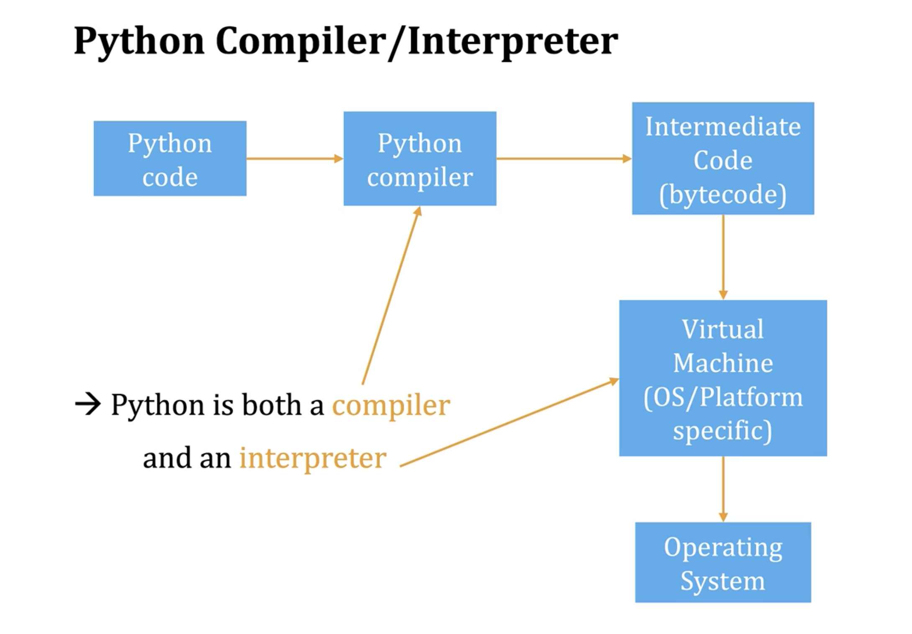

# Python Crash Course

(book by Eric Matthes)

## What is Python?

Python is a language, not a application.
There are many implementations of Python:

- CPython -> C/C++
- Iron Python -> .NET
- Jython -> Java
- Pypy

The "reference" Python implementation is CPython

### Virtual Environments

We use built-in `venv` to create a virtual environment. It allows us to isolate packages from other projects so that we can avoid version conflicts.

Behind the scene, it creates a folder with a copy of specific version of Python and adds the path into PATH env var.

- we can check by running `echo $PATH`
- or by `which python`
- the copy is used by symlinks

It provides the script to activate and deactivate the environment.

- activate -> unset old path and set new path
- deactivate -> unset old path

A couple of conventions:

- usually named `venv` or `.venv`
- ignored from Git

```bash
# create a virtual env
python3 -m venv my-project-venv

# activate my-project-venv
source ./my-project-venv/bin/activate

# deactivate
deactivate
```

### Using pip: Package Installer for Python

We use a file, requirements.txt, to keep track of required packages and versions.

```bash
pip install -r ./requirements.txt
```

### How to run Python?

Python is both a compiler and a interpreter.

1. interactive mode, also called REPL(read-eval-print-loop)
   - Python shell, running `python`
   - Jupyter notebooks(browser based REPL), running `jupyter notebook`
2. script mode
   - `python my_app.py`



## Basic Principles

Everything in Python is an object, it has attributes:

- state
- functionality

Mutability v.s Immutability

- Immutable: integer, float, boolean, string
- Mutable: list, dictionary, set, etc


