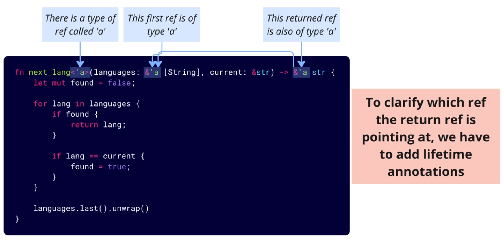

# Advanced Lifetimes: Mastering Rust's Memory Model

Lifetime annotations: `<'a>`, `&'a`

- used with functions, structs, enums, etc
- help the compiler to make sure refs won't outlive the value they refer to
- this seems like something the compiler should do on its own

let's try to work on these functions,


```rust
fn next_language(languages: &[String], current: &str) -> &str {
    let mut found = false;
    for language in languages {
        if found {
            return language;
        }
        if language == current {
            found = true;
        }
    }
    languages.last().unwrap()
}

fn main() {
    let result;
    {
        let languages = vec![
            String::from("rust"),
            String::from("typescript"),
            String::from("python"),
        ];
        result = next_language(&languages, "rust");
    }
    // we will get an error. languages is dropped here
    // but result is the ref to the item in languages

    println!("{:#?}", result);
}
```

One big reason why do we need lifetime annotations,


And Rust will NOT analyze the body of your function to figure out whether the return ref is pointing at the first of the second argument.



Super common questions:

1. Why does it matter whether the return ref points at the first or the second argument? -> If you returned a reference without clarifying which argument's lifetime it depends on, you might risk referencing a value that goes out of scope.
2. Why doesn't Rust analyze the function body to figure out if the returned ref pointes at the first or second argument? -> The function signature makes it clear that the returned ref will be tied to which argument.

```rust
fn split<'a>(text: &'a str, pattern: &str) -> &'a str
```

Generally when a function is receiving a ref and returning a ref, we have to think about the lifetime issues. However, there are 2 scenarios we can omit the lifetime annotations,

1. Function that takes one ref and any number of values, and returns one ref.

```rust
fn first_language(languages: &[String]) -> &str
fn generate(set: &[i32], range: i32) -> &str
fn leave(message: &Message, text: String) -> &str
```

2. Method that takes `&self` and any number of other refs, and returns one ref. -> Rust will assume the returned ref will point at `&self`.

```rust
struct Bank {
    name: String,
}
impl Bank {
    fn get_name(&self, default_name: &str) -> &str {
        &self.name
    }
}
```

> Omitting lifetime annotations is referred to as **elision**.

