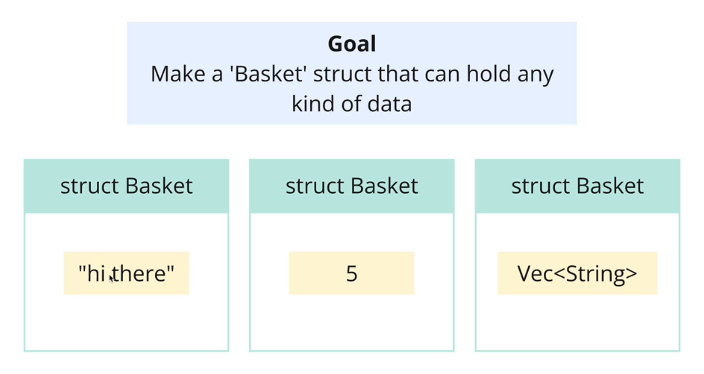
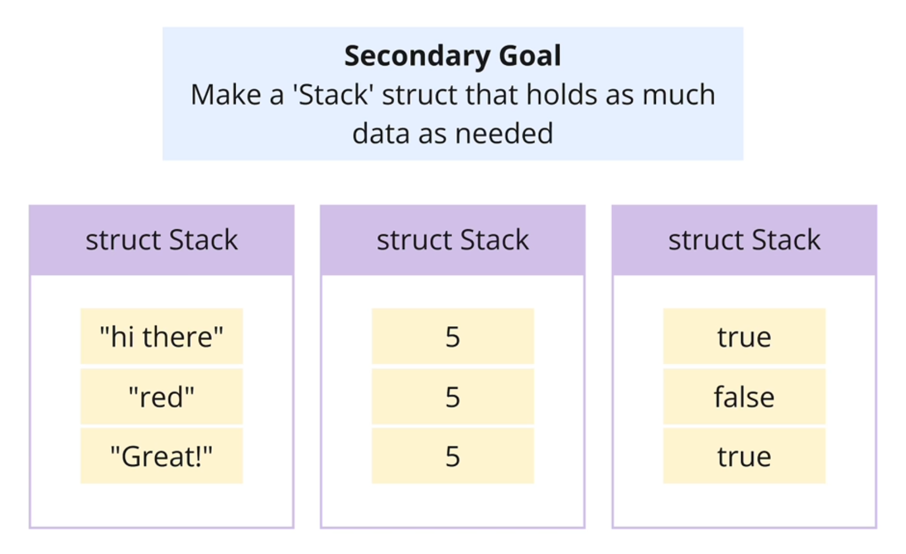
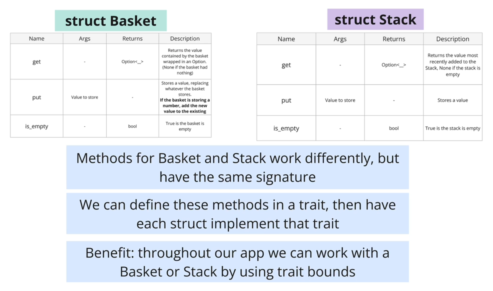
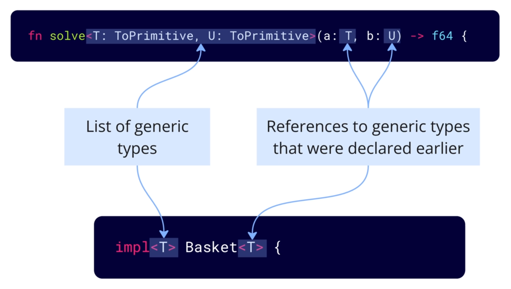
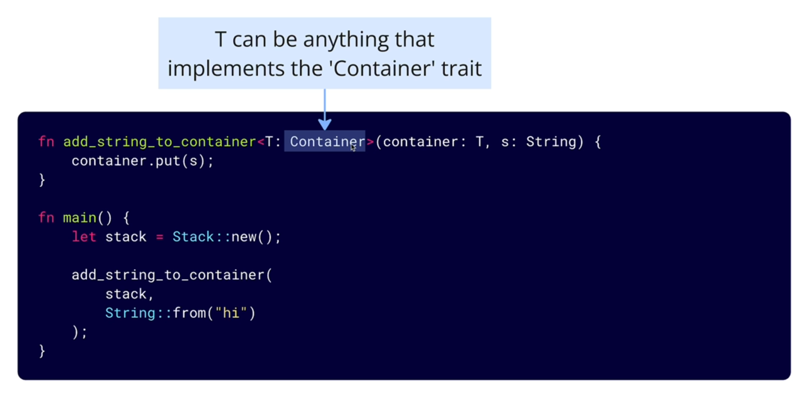

# Generics and Traits: Writing Flexible, Reusable Code

Let's say we want to build a `solve` function that can solve the Pythagorean theorem for any float numbers, `f32` or `f64`.

```rust
use num_traits::Float;

fn solve<T: Float, U: Float>(a: T, b: U) -> f64 {
    let a_tof64 = a.to_f64().unwrap();
    let b_tof64 = b.to_f64().unwrap();

    (a_tof64.powi(2) + b_tof64.powi(2)).sqrt()

}
fn main() {
    let a: f32 = 3.0;
    let b: f64 = 4.0;
    println!("{:#?}", solve(a, b));
}
```

If we want make `solve` function to work with ANY type of numbers, we can simply replace `Float` with `ToPrimitive` trait.

## Traits

In the example above, `Float` is a trait. Traits are like interfaces in other languages.

- A trait is a set of methods that a type must implement.
- It can contain **abstract methods** which don't have an implementation.
- It can also contain **default methods** which have an implementation.

```rust
trait Vehicle {
    // abstract method
    fn start(&self);
    // default method
    fn stop(&self) {
        println!("Vehicle stopped");
    }
}
```

- A struct, enum, primitive, etc can implement a trait.
- The implementer has to provide an implementation for all the **abstract methods**
- The implementer can **optionally** override the default methods.

```rust
struct Car {};
impl Vehicle for Car {
    fn start(&self) {
        println!("Car started");
    }
}
```

Now after we implement the trait `Vehicle` for the struct `Car`,

1. `Car` is considered to be a type `Vehicle`
2. `Car` can access to the methods defined in the `Vehicle` trait

```rust
fn start_and_stop<T: Vehicle>(vehicle: &T) {
    vehicle.start();
    vehicle.stop();
}

fn main() {
    let car = Car {
        model: String::from("Toyota"),
        year: 2021,
    };
    start_and_stop(&car);
}
```

## Real Example





Let's start to implement the `Basket` struct, but only for `String` type.

```rust
// basket.rs
pub struct Basket {
    item: Option<String>,
}

impl Basket {
    pub fn new(item: String) -> Self {
        Basket { item: Some(item) }
    }
    pub fn get(&mut self) -> Option<String> {
        self.item.take()
    }
    pub fn put(&mut self, item: String) {
        self.item = Some(item);
    }
    pub fn is_empty(&self) -> bool {
        self.item.is_none()
    }
}

// main.rs
mod basket;

use basket::Basket;

fn main() {
    let mut basket = Basket::new(String::from("apple"));
}
```

Now we want to make `Basket` struct to work with any type of items, we can use generics.

Notice a bit confusing syntax here, `impl<T> Basket<T>`,



```rust
// basket.rs
pub struct Basket<T> {
    item: Option<T>,
}

impl<T> Basket<T> {
    pub fn new(item: T) -> Self {
        Basket { item: Some(item) }
    }
    pub fn get(&mut self) -> Option<T> {
        self.item.take()
    }
    pub fn put(&mut self, item: T) {
        self.item = Some(item);
    }
    pub fn is_empty(&self) -> bool {
        self.item.is_none()
    }
}

// main.rs
mod basket;

use basket::Basket;

fn main() {
    let mut basket_1 = Basket::new(String::from("apple"));
    let mut basket_2 = Basket::new(100);
    let mut basket_3 = Basket::new(true);
}
```

Now we can make `Basket` struct to work with any type of items,

```rust
// stack.rs
pub struct Stack<T> {
    items: Vec<T>,
}

impl<T> Stack<T> {
    pub fn new(items: Vec<T>) -> Self {
        Stack { items }
    }
    pub fn get(&mut self) -> Option<T> {
        self.items.pop()
    }
    pub fn put(&mut self, item: T) {
        self.items.push(item);
    }
    pub fn is_empty(&self) -> bool {
        self.items.is_empty()
    }
}

// main.rs
mod stack;

use stack::Stack;

fn main() {
    let mut stack_1 = Stack::new(vec![
        String::from("apple"),
        String::from("banana"),
        String::from("cherry"),
    ]);
    let mut stack_2 = Stack::new(vec![1, 2, 3]);
    let mut stack_3 = Stack::new(vec![true, false, true]);
}
```

Now let's implement the `Container` trait so that we can work with `Basket` & `Stack` by using trait bounds,



```rust
// container.rs
pub trait Container<T> {
    fn get(&mut self) -> Option<T>;
    fn put(&mut self, item: T);
    fn is_empty(&self) -> bool;
}

// basket.rs
use super::container::Container;

pub struct Basket<T> {
    item: Option<T>,
}

impl<T> Basket<T> {
    pub fn new(item: T) -> Self {
        Basket { item: Some(item) }
    }
}

impl<T> Container<T> for Basket<T> {
    fn get(&mut self) -> Option<T> {
        self.item.take()
    }
    fn put(&mut self, item: T) {
        self.item = Some(item);
    }
    fn is_empty(&self) -> bool {
        self.item.is_none()
    }
}

// same as stack.rs
// ...

// main.rs
mod basket;
mod container;
mod stack;

use basket::Basket;
use container::Container;
use stack::Stack;

fn add_string<T: Container<String>>(container: &mut T, item: String) {
    container.put(item);
}

fn main() {
    let mut basket = Basket::new(String::from("ball"));
    add_string(&mut basket, String::from("pencel"));

    let mut stack = Stack::new(vec![
        String::from("apple"),
        String::from("banana"),
        String::from("cherry"),
    ]);
    add_string(&mut stack, String::from("grape"));
}
```

