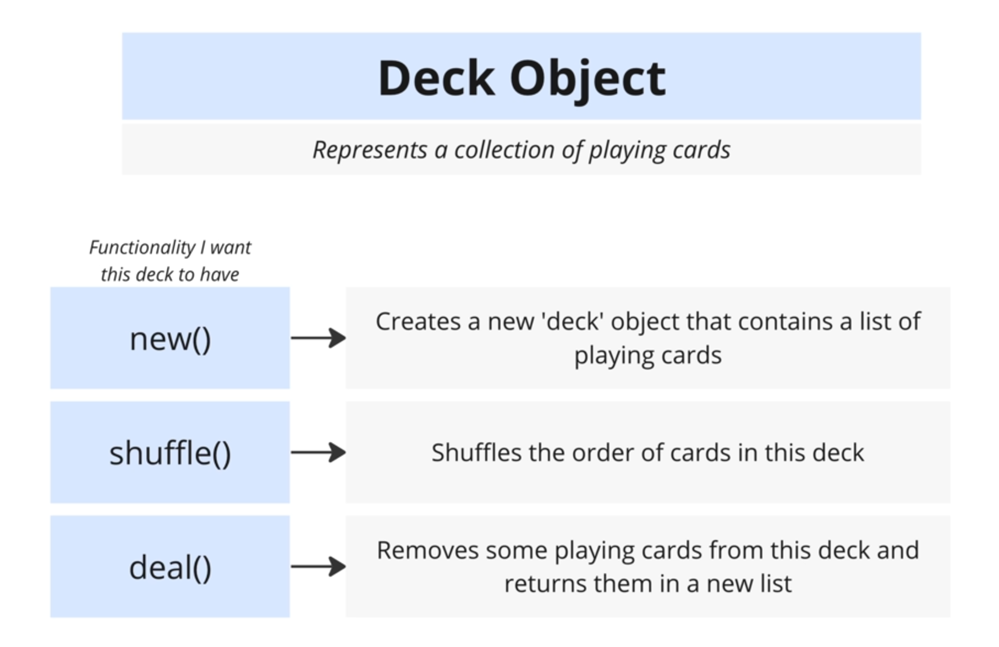

# Rust Complete Developer's Guide

(Udemy course by Stephen Grider)

## Foundations of Rust Setup

```bash
# create a new project
cargo new <project-name>

# run a project
cargo run
```

## Core Concepts of Rust



```rust
#[derive(Debug)]
struct Deck {
    cards: Vec<String>
}

fn main() {
    let mut deck = Deck { cards: vec![] };

    // should use array rather than vector since they're fixed length
    let suits = ["Spades", "Hearts", "Diamonds", "Clubs"];
    let values = ["Ace", "Two", "Three", /*...*/ "Jack", "Queen", "King"];

    for suit in suits {
        for value in values {
            let card = format!("{} of {}", value, suit);
            deck.cards.push(card);
        }
    }

    println!("Here is the deck: {:#?}", deck);
}
```

Key concepts:

1. How to declare a `struct` type? How to use `struct` literal to create a instance?
2. Variables/bindings are immutable by default.

```rust
let number = vec![];
// error! cannot change the value
numbers.push(1);
// error! cannot reassign
numbers = vec![];

let mut strings = vec![];
// works!
strings.push("hello")
```

3. The concept of vector and array.

```rust
// vector: A contiguous growable array type.
let mut vec = Vec::new();
vec.push(1);
vec.push(1);
assert_eq!(vec.len(), 2);
// The vec! macro is provided for convenient initialization:
let mut vec = vec![1, 2, 3];
assert_eq!(vec.len(), 3);

// array: A fixed-size array.
let mut array: [i32; 3] = [0; 3];
```

4. How to `println!` your struct?
   - add `derive(Debug)` to create the implementation required to make this `struct` printable with `fmt::Debug`
     - the `derive` is an attribute that tells the compiler to add additional code to `struct`
     - `Debug` is a trait, has functions included that aid in debugging, like printing a `struct`.
   - use `{:#?}` for pretty printing

### Implement Functionalities for a Type

- The `impl` keyword (Inherent implementations) is a fancy term for "add function to a struct".
- It's used to define:
  - **methods**: operates on a specific instance of struct, like `shuffle`
  - **associated functions (or class method)**:
    - function not tied to the specific instance, like `new`.
    - **associated functions** are called using the `::` syntax.

```rust
#[derive(Debug)]
struct Deck {
    cards: Vec<String>,
}

impl Deck {
    fn new() -> Self {
        let mut deck = Deck { cards: vec![] };
        // should use array rather than vector since they're fixed length
        let suits = ["Spades", "Hearts", "Diamonds", "Clubs"];
        let values = ["Ace", "Two", "Three", /*...*/ "Jack", "Queen", "King"];
        for suit in suits {
            for value in values {
                let card = format!("{} of {}", value, suit);
                deck.cards.push(card);
            }
        }
        deck
    }
}

fn main() {
    let deck = Deck::new();
    println!("Here is the deck: {:#?}", deck);
}
```

Key concepts:

1. Implicit return

   - no `return`
   - no `;`

```rust
fn is_even(num: i32) -> bool {
   return num % 2 == 0;
   // or
   num % 2 == 0
}
```

### Installing External Crates

`Crate` is equal to package. There are:

- Rust standard library: doc.rust-lang.org/std
- External crates: crates.io, docs.rs

```bash
# install an external crate: rand
cargo add rand
```

### Final Code of The Deck Project

```rust
use rand::{seq::SliceRandom, thread_rng};

#[derive(Debug)]
struct Deck {
    cards: Vec<String>,
}

impl Deck {
    fn new() -> Self {
        let mut deck = Deck { cards: vec![] };

        // should use array rather than vector since they're fixed length
        let suits = ["Spades", "Hearts", "Diamonds", "Clubs"];
        let values = [
            "Ace", "Two", "Three", "Four", "Five", "Six", "Seven", "Eight", "Nine", "Ten", "Jack",
            "Queen", "King",
        ];

        for suit in suits {
            for value in values {
                let card = format!("{} of {}", value, suit);
                deck.cards.push(card);
            }
        }

        deck
    }
    fn shuffle(&mut self) {
        let mut rng = thread_rng();
        self.cards.shuffle(&mut rng);
    }
    fn deal(&mut self, num_of_cards: usize) -> Vec<String> {
        self.cards.split_off(self.cards.len() - num_of_cards)
    }
}

fn main() {
    let mut deck = Deck::new();
    deck.shuffle();
    // TODO: should add error handling when num_of_cards is larger than deck size
    let cards = deck.deal(2);

    println!("Here is the deck: {:#?}", deck);
    println!("Here is the hand: {:#?}", cards);
}
```
