# Rust Complete Developer's Guide

(Udemy course by Stephen Grider)

## Foundations of Rust Setup

```bash
# create a new project
cargo new <project-name>

# run a project
cargo run
```

## Core Concepts of Rust


```rust
#[derive(Debug)]
struct Deck {
    cards: Vec<String>
}

fn main() {
    let mut deck = Deck { cards: vec![] };

    // should use array rather than vector since they're fixed length
    let suits = ["Spades", "Hearts", "Diamonds", "Clubs"];
    let values = ["Ace", "Two", "Three", /*...*/ "Jack", "Queen", "King"];

    for suit in suits {
        for value in values {
            let card = format!("{} of {}", value, suit);
            deck.cards.push(card);
        }
    }

    println!("Here is the deck: {:#?}", deck);
}
```

Key concepts:

1. How to declare a `struct` type? How to use `struct` literal to create a instance?
2. Variables/bindings are immutable by default.

   ```rust
   let number = vec![];
   // error! cannot change the value
   numbers.push(1);
   // error! cannot reassign
   numbers = vec![];

   let mut strings = vec![];
   // works!
   strings.push("hello")
   ```

3. The concept of vector and array.

   ```rust
   // vector: A contiguous growable array type.
   let mut vec = Vec::new();
   vec.push(1);
   vec.push(1);
   assert_eq!(vec.len(), 2);
   // The vec! macro is provided for convenient initialization:
   let mut vec = vec![1, 2, 3];
   assert_eq!(vec.len(), 3);

   // array: A fixed-size array.
   let mut array: [i32; 3] = [0; 3];
   ```

4. How to `println!` your struct?
   - add `derive(Debug)` to create the implementation required to make this `struct` printable with `fmt::Debug`
     - the `derive` is an attribute that tells the compiler to add additional code to `struct`
     - `Debug` is a trait, has functions included that aid in debugging, like printing a `struct`.
   - use `{:#?}` for pretty printing

### Implement Functionalities for a Type

- The `impl` keyword (Inherent implementations) is a fancy term for "add function to a struct".
- It's used to define:
  - **methods**: operates on a specific instance of struct, like `shuffle`
  - **associated functions (or class method)**:
    - function not tied to the specific instance, like `new`.
    - **associated functions** are called using the `::` syntax.

```rust
#[derive(Debug)]
struct Deck {
    cards: Vec<String>,
}

impl Deck {
    fn new() -> Self {
        let mut deck = Deck { cards: vec![] };
        // should use array rather than vector since they're fixed length
        let suits = ["Spades", "Hearts", "Diamonds", "Clubs"];
        let values = ["Ace", "Two", "Three", /*...*/ "Jack", "Queen", "King"];
        for suit in suits {
            for value in values {
                let card = format!("{} of {}", value, suit);
                deck.cards.push(card);
            }
        }
        deck
    }
}

fn main() {
    let deck = Deck::new();
    println!("Here is the deck: {:#?}", deck);
}
```

Key concepts:

1. Implicit return
   - no `return`
   - no `;`

   ```rust
   fn is_even(num: i32) -> bool {
       return num % 2 == 0;
       // or
       num % 2 == 0
   }
   ```

### Installing External Crates

`Crate` is equal to package. There are:

- Rust standard library: doc.rust-lang.org/std
- External crates: crates.io, docs.rs

```bash
# install an external crate: rand
cargo add rand
```

### Numbers Type

- Positive or negative integers
  - `isize`: often used when indexing some sort of collection
- Unsigned integers
  - `usize`: often used when referring to the size of collection
- Decimal values


### Final Code of The Deck Project

```rust
use rand::{seq::SliceRandom, thread_rng};

#[derive(Debug)]
struct Deck {
    cards: Vec<String>,
}

impl Deck {
    fn new() -> Self {
        let mut deck = Deck { cards: vec![] };

        // should use array rather than vector since they're fixed length
        let suits = ["Spades", "Hearts", "Diamonds", "Clubs"];
        let values = [
            "Ace", "Two", "Three", "Four", "Five", "Six", "Seven", "Eight", "Nine", "Ten", "Jack",
            "Queen", "King",
        ];

        for suit in suits {
            for value in values {
                let card = format!("{} of {}", value, suit);
                deck.cards.push(card);
            }
        }

        deck
    }
    fn shuffle(&mut self) {
        let mut rng = thread_rng();
        self.cards.shuffle(&mut rng);
    }
    fn deal(&mut self, num_of_cards: usize) -> Vec<String> {
        self.cards.split_off(self.cards.len() - num_of_cards)
    }
}

fn main() {
    let mut deck = Deck::new();
    deck.shuffle();
    // TODO: should add error handling when num_of_cards is larger than deck size
    let cards = deck.deal(2);

    println!("Here is the deck: {:#?}", deck);
    println!("Here is the hand: {:#?}", cards);

}
```

## Rust Memory System: Ownership and Borrowing

- The goal of ownership is to limit the ways you can **reference** and **change** the data.
- This limitation will reduce the number of bugs and make your code easier to understand.

Consider a buggy code in JavaScript:

```javascript
const engine = {
  working: false,
};
const honda = {
  name: "Honda",
  engine,
};
const toyota = {
  name: "Toyota",
  engine,
};
```

This piece of code is buggy because both cars are references to the same value. If we change the state of honda's engine, toyota will also be affected.

We can avoid this bug by having some rules,

1. Multiple things can refer to a value at the same time, but the reference ensures the value is read-only.
2. The value can only be updated when there are no read-only reference to it.
3. The value can only be updated when it's referenced to ONLY one thing.

Here are the 12 rules to check of ownership, borrowing and lifetimes concepts,

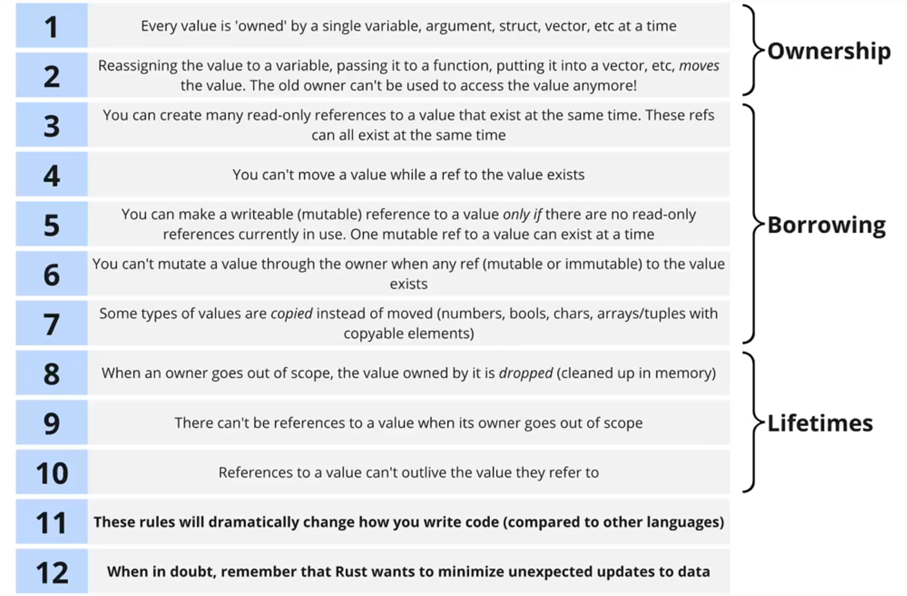

> In essence, Rust wants to avoid **unexpected updates**.

### Ownership

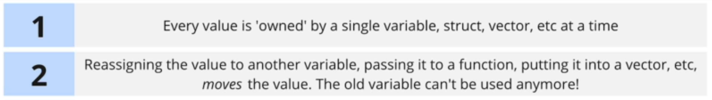

For rules 1 and 2 that are related to ownership, let's consider the code below:

```rust
#[derive(Debug)]
struct Account {
    id: u32,
    balance: i32,
    holder: String,
}
impl Account {
    fn new(id: u32, holder: String) -> Self {
        Account {
            id,
            holder,
            balance: 0,
        }
    }
}
fn print_account(account: Account) {
    println!("account: {:#?}", account);
}

fn main() {
    let account = Account::new(1, String::from("kevin"));

    // value moved -> pass it to a function
    print_account(account);
    print_account(account); // error: use of moved value

    // value moved -> reassign the value to another value
    let another_account = account;
    print_account(account); // error: use of moved value

    // value moved -> put it into a vector
    let accounts = vec![account];
    print_account(account); // error: use of moved value

    // value partially moved
    let holder_name = account.holder;
    print_account(account); // error: use of partially moved value
}
```

### Introduce Borrowing System

Ref allows us to look at a value without moving it.

- `&` operator being used on a type -> This argument needs to be a reference to a value.
- `&` operator being used on the owner of a value -> Create a reference to a this value.

```rust
fn print_account(account: &Account) {
    println!("account: {:#?}", account);
}

fn main() {
    let account = Account::new(1, String::from("kevin"));

    print_account(&account);
    print_account(&account);
}
```

For rules number 3 & 4, consider code below:


```rust
fn main() {
    let account = Account::new(1, String::from("kevin"));
    let ref_account_0 = &account;
    let ref_account_1 = &account;
    let ref_account_2 = &account; // we can create many immutable references to the value
    let other_account = account; // error: cannot move because it is borrowed

    print_account(ref_account_0);
    print_account(ref_account_1);
    print_account(ref_account_2);
}
```

#### Introduce Mutable References

Mutable references allow us to change or read a value without moving it.

```rust
fn change_account_balance(account: &mut Account, amount: i32) {
    account.balance = amount;
}

fn main() {
    let mut account = Account::new(1, String::from("kevin"));
    change_account_balance(&mut account, 200);
}
```

For rules 5 & 6, consider code below:

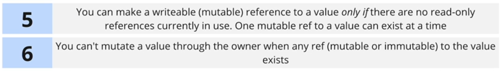

```rust
fn main() {
    let mut account = Account::new(1, String::from("kevin"));
    let account_ref = &account;

    // error: cannot borrow 'account' as mutable because it's borrowed as immutable
    change_account_balance(&mut account, 200);

    println!("{:#?}", account_ref);
}
```

```rust
fn main() {
    let mut account = Account::new(1, String::from("kevin"));

    // error: one mutable reference to a value can exist at a time
    let account_ref = &mut account;
    change_account_balance(&mut account, 200);

    println!("{:#?}", account_ref);
}
```

```rust
fn main() {
    let mut account = Account::new(1, String::from("kevin"));

    let account_ref = &mut account;
    // error: cannot mutate a value through the owner when any reference to the value exists
    account.balance = 0;

    change_account_balance(&mut account, 200);
    println!("{:#?}", account_ref);
}
```

For rule #7, need to remember there are some types of values will be copied instead of moved.


### Introduce Lifetimes

`Lifetimes` refers to how long an owner/reference exists.


For rules 8 to 10, consider the code below:

```rust
fn make_and_print_account() -> &Account {
    let account = Account::new(1, String::from("kevin"));
    println!("{:#?}", account);

    // error: owners goes out of scope while a reference still exists
    &account

    // after this point, the 'account' binding and the Account value are dropped
}

fn main() {
    let account_ref = make_and_print_account();
    println!("{:#?}", account_ref);
}
```

> With every function we write we have to think about we're receiving **values** or **refs**.

> With every data structure we write we have to think about whether we're storing **values** or **refs**.

### Deciding on Argument Types

Three cases:

1. Need to store the argument somewhere? -> Favor taking ownership.
2. Need to do a calculation with the value -> Favor receiving a read-only ref.
3. Need to change to value in some way -> Favor receiving a mutable ref.

Consider add a method `add_account` into `Bank`, add `deposit` and `withdraw` methods into `Account`,

What is the argument type should we put?

```rust
struct Account {
    id: u32,
    balance: i32,
    holder: String,
}
impl Account {
    fn new(id: u32, holder: String) -> Self {
        Account {
            id,
            holder,
            balance: 0,
        }
    }
    fn deposit(&mut self, amount: i32) -> i32 {
        self.balance += amount;

        self.balance
    }
    fn withdraw(&mut self, amount: i32) -> i32 {
        self.balance -= amount;

        self.balance
    }
}

struct Bank {
    accounts: Vec<Account>,
}
impl Bank {
    fn new() -> Self {
        Bank { accounts: vec![] }
    }
    fn add_account(&mut self, account: Account) {
        self.accounts.push(account);
    }
}

fn main() {
    let mut bank = Bank::new();
    let mut account = Account::new(1, String::from("kevin"));
    bank.add_account(account);

    account.deposit(100);
    account.withdraw(50);

    println!("{:#?}", bank);
}
```

## Enums: Unleashed Pattern Matching and Options

When we need to modal several different things that are all kind of similar, two options for this:

1. `Structs`
2. `Enums`

Defining enums,

```rust
// Book, Movie, AudioBook, Podcast and Placeholder are all of the type Media
// We can define functions accept values of type 'Media'
#[derive(Debug)]
enum Media {
    Book { title: String, author: String },
    Movie { title: String, director: String },
    AudioBook { title: String },
    Podcast(u32), // unlabeled field
    Placeholder, // no field
}

fn print_media(media: Media) {
    println!("{:#?}", media);
}
fn main() {
    let book = Media::Book {
        title: String::from("A book."),
        author: String::from("An author")
    };
    let movie = Media::Movie {
        title: String::from("A movie."),
        director: String::from("A director")
    };
    let audio_book = Media::AudioBook {
        title: String::from("An audiobook."),
    };
    let podcast = Media::Podcast(1);
    let placeholder = Media::Placeholder;

    print_media(book);
    print_media(movie);
    print_media(audio_book);
    print_media(podcast);
    print_media(placeholder);
}
```

### Adding Implementations to Enums

Let's say we want to add a method `description` under `Media` enum, there are two ways to do type checking,

1. pattern matching, `if let ...`
2. `match` statement -> suggested

```rust
#[derive(Debug)]
enum Media { /* */ }
impl Media {
    // 1. Pattern Matching
    fn description(&self) -> String {
        if let Media::Book { title, author } = self {
            format!("Book: {} {}", title, author)
        } else if let Media::Movie { title, director } = self {
            format!("Movie: {} {}", title, director)
        } else if let Media::AudioBook { title } = self {
            format!("Audio Book: {}", title)
        } else if let Media::Podcast(id) = self {
            format!("Podcast: {}", id)
        } else if let Media::Placeholder = self {
            format!("Placeholder")
        } else {
            String::from("Media description")
        }
    }
    // 2. `match` statement
    fn description(&self) -> String {
        match self {
            Media::Book { title, author } => format!("Book: {} {}", title, author),
            Media::Movie { title, director } => format!("Movie: {} {}", title, director),
            Media::AudioBook { title } => format!("Audio Book: {}", title),
            Media::Podcast(id) => format!("Podcast: {}", id),
            Media::Placeholder => format!("Placeholder"),
        }
}

fn main() {
    let book = Media::Book { /* */ };
    let movie = Media::Movie { /* */ };
    let audio_book = Media::AudioBook { /* */ };
    let podcast = Media::Podcast(1);
    let placeholder = Media::Placeholder;

    println!("{}", book.description());
    println!("{}", movie.description());
    println!("{}", audio_book.description());
    println!("{}", podcast.description());
    println!("{}", placeholder.description());
}
```

Deciding when to use `enums` v.s `structs`, ask one question:

- Does each thing you're modeling have the **same methods**? -> use `enums`
- Does each thing have some same, some different methods? -> use `structs`

### The Option Enum

```rust
enum Option {
    Some(value),
    None,
}
```

- Rust doesn't have `null`, `nil` or `undefined`.
- Instead, we get a built-in enum `Option` having two variants: `Some` and `None`.
- This forces us to handle and avoid unexpected errors.

For example, when we want to get an item from a list,

```rust
// 'match' statement
match vec![1, 2, 3].get(10) {
    Some(value) => println!("Value: {}", value),
    None => println!("Nothing at the index"),
}

// pattern matching
if let Some(value) = vec![1, 2, 3].get(0) {
    println!("Value: {}", value)
} else {
    println!("Nothing at the index")
}
```

Using `match` is the ideal way to figure out if we have `Some` or `None`, but there are other ways that are more compact but have big downsides.

1. `item.unwrap()`
   - if item is `Some`, returns the value in the `Some`
   - if item is `None`, panics!
   - use for quick debugging
2. `item.expect("there should be a value here")`
   - if item is `Some`, returns the value in the `Some`
   - if item is `None`, prints the provided debug message and panics!
   - use when we **want** to crash if there is no value
3. `item.unwrap_or(&placeholder)`
   - if item is `Some`, returns the value in the `Some`
   - if item is `None`, returns the provided value
   - use when it makes sense to provide a fallback value

## Handling the Unexpected Errors and Results

Introducing the `Result` enum,

```rust
enum Result<T, E> {
    Ok(T),
    Err(E),
}
```

### Type of Errors

- Many modules in the std lib have their own custom error types
  - `std::str::Utf8Error`
  - `std::string::FromUtf8Error`
  - `std::num::ParseIntError`
  - `std::num::ParseFloatError`
  - `std::num::TryFromIntError`
  - `std::thread::JoinError`
  - `std::io::Error`
- You can also create your own custom types of errors
- There is no general-purpose catch-all type of error, like `Error` in JavaScript or `Exception` in Python

```rust
// Import and used to represent an error
use std::io::Error;

fn divide(a: f64, b: f64) -> Result<f64, Error> {
    if b == 0.0 {
        Err(Error::other("can't divided by 0")) // Create an instance of the Error
    } else {
        Ok(a / b)
    }
}

fn main() {
    match divide(5.0, 3.0) {
        // The calculated value is 1.66667
        Ok(value) => println!("The calculated value is {:#?}", value),

        // Custom { kind: Other, error: "can't divided by 0" }
        Err(err) => println!("{:#?}", err),
    }
}
```

### Empty Ok Variants

Consider if we have a successful operation that does not give us any value,

- writing data to a file
- removing a file/directory
- permission check
- validating a string

Since `Ok` variant must have something inside it, we pass empty tuple -> `Ok(())`.

Then inside the `match` statement, we use `..` if we want to ignore the values inside the `Ok` variant.

```rust
fn validating_email(email: String) -> Result<(), Error> {
    if email.contains('@') {
        // pass empty tuple
        Ok(())
    } else {
        Err(Error::other("email must have an @"))
    }
}

fn main() {
    match validating_email(String::from("test@test.com")) {
        // to ignore values inside the Ok variant
        Ok(..) => println!("email is valid!"),
        Err(err) => println!("{}", err)
    }
}
```

### Introduce Tuples

```rust
type Rgb = (u8, u8, u8);
fn make_rgb() -> Rgb {
    (0, 128, 255)
}

fn main() {
    let color = make_rgb();
    let red = color.0;
}
```

### Introduce String Types

1. `String`:

   - when we create a `String`, the `Data segment` already has the "red" literal
   - then Rust will create a struct as `String` metadata in `Stack`
   - and at the same time, Rust will copy the text data from `Data segment` and store inside `Heap`
   - the pointer of the metadata will point to the data in `Heap`

   ```rust
   String::from("red");
   "red".to_string();
   ```


2. `&String`: string refs (read-only)
   - after created the `String`
   - create a ref and point to the `String` struct

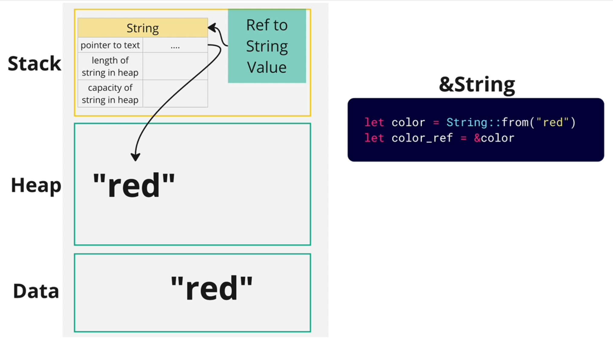

3. `&str`: string slices

   ```rust
   "red";
   String::from("red").as_str();
   ```

For `&str`, `Heap` is not used at all, there are two cases,

1st case:

- `Data segment` has the "red" literal
- Rust will create a struct as `&str` metadata in `Stack`, but it only has 2 fields
- the pointer to text field points directly to the data inside the `Data segment`

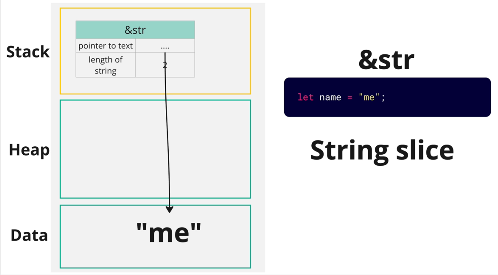

2nd case (by calling `as_str()`),

- after created the `String`
- Rust will create a struct as `&str` metadata in `Stack`, but it only has 2 fields
- the pointer to text field will point to the data inside `Heap` that is owned by other `String`

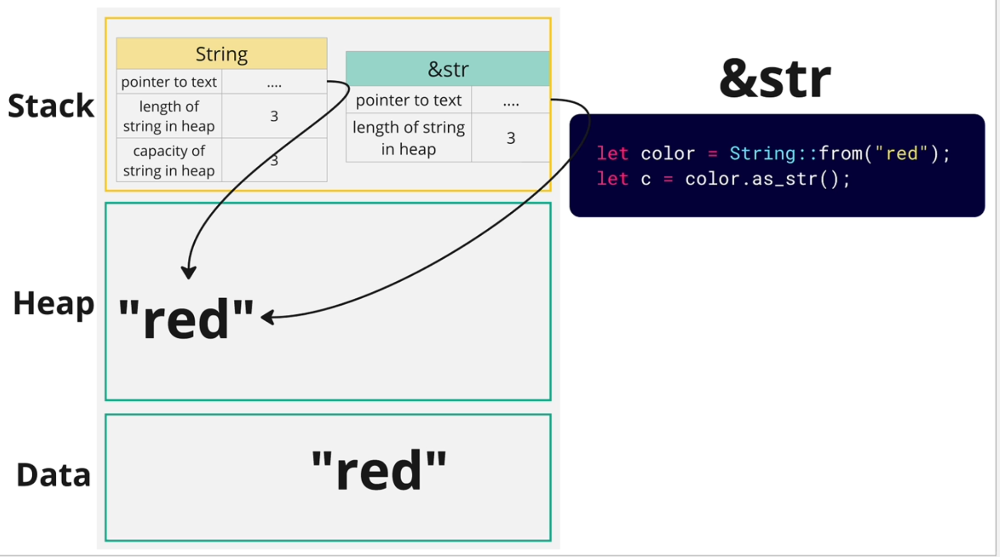

In order to discuss the difference between them, we have to understand computer memory and how it is used by Rust.

- Stack: fast but limited size(2-8 MB)
- Heap: slow but can grow to store a lot of data
- Data Segment/Rodata(Read-only data) Segment/Static Segment: store literal values that we wrote into our code

#### Common Pattern in Rust


Consider this code in Rust, `let nums = vec![1, 2, 3, 4 ,5]`,

1. `Stack`: stores metadata(pointer to values, length, capacity, etc) about the data structure
2. `Heap`: stores actual data
3. `Data Segment`: the default data written in the code will be stored in data segment. when we create the vector, the list here will be copied and placed into heap.

> This is to avoid running out of memory in the stack if the data structure grows a lot of data.

Corner case: if a data structure owns another data structure, the child's metadata will be stored in the heap

```rust
// corner case
let vec_of_nums = vec![vec![1, 2, 3], vec![1, 2, 3]];
```

### Why Is There &String And &str?

Both provide a read-only reference to the text data, but there are two reasons that we prefer to use `&str`,

1. `&str` let you refer to text in the data segment without a heap allocation 👉 more efficient
2. `&str` lets you take a slice of text that is already in the heap

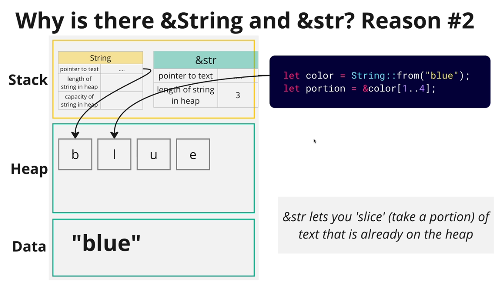

### When To Use Which Type?

- String
  - use anytime we want the **ownership** of text
  - use anytime we want the text that can **grow** or **shrink**
- &String
  - rarely used
  - Rust will automatically turn `&String` into `&str`
- &str
  - use anytime we **don't** want the **ownership** of text
  - use anytime when we want to take a portion of a string owned by something else


### Real Example Issue

Consider a real example of reading text from file,

```rust
use std::fs;

fn extract_errors(text: &str) -> Vec<&str> {
    let split_text = text.split('\n');

    let mut results = vec![];
    for line in split_text {
        if line.starts_with("ERROR") {
            results.push(line);
        }
    }

    results
}

fn main() {
    match fs::read_to_string("logs.txt") {
        Ok(text_that_was_read) => {
            let error_logs = extract_errors(text_that_was_read.as_str());
            println!("{:#?}", error_logs);
        }
        Err(error) => println!("why failed, {}", error),
    }
}
```

As long as we make a simple change, we start to see an error from Rust complilor 👉 'text_that_was_read' does not live long enough

```rust
fn main() {
    let mut error_logs = vec![];

    match fs::read_to_string("logs.txt") {
        Ok(text_that_was_read) => {
            error_logs = extract_errors(text_that_was_read.as_str()); // 'text_that_was_read' does not live long enough!
        }
        Err(error) => println!("why failed, {}", error),
    }

    println!("{:#?}", error_logs);
}
```

The reason is because `split` methond returns `Vec<&str>`,

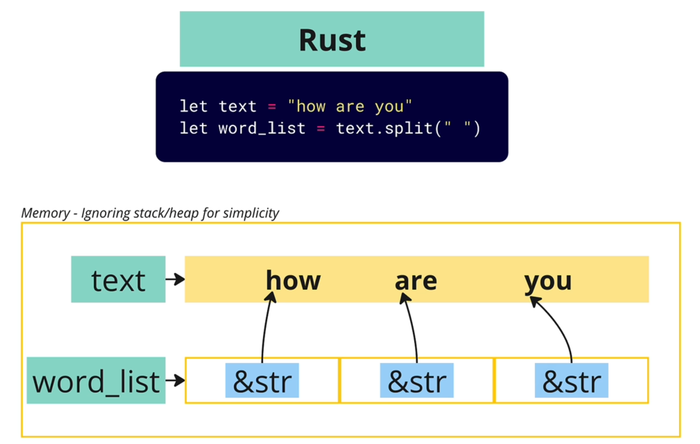

Diagram of memory allocation line by line of `extract_errors` function,

> Usually for most values in Rust, it move values around, but for references, they follow **copy** synmatics.


After `extract_errors` function finished, `split_text` and `results` variables will be dropped. Then move to the `main` function, when the `Ok` statement is finished, `text_that_was_read` will be dropped while `error_logs` variable is still there since it's declaired outside of the `match` statement.

👉 And this is how the issue occurs, the `error_logs` items are trying to point to data that was dropped.

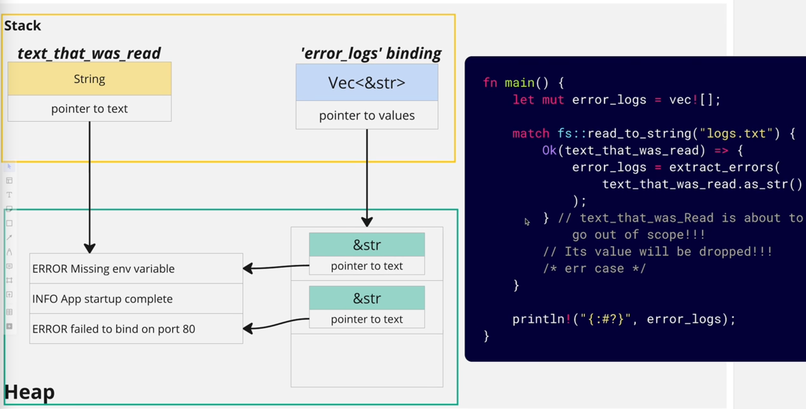

In order to fix, we just have to update `extract_errors` to return `Vec<String>` so that `results` owns the data.

When we call `to_string()`, since it returns `String`, the data is copied in the heap and owned by `results`.

```rust
fn extract_errors(text: &str) -> Vec<String> {
    let split_text = text.split('\n');

    let mut results = vec![];
    for line in split_text {
        if line.starts_with("ERROR") {
            results.push(line.to_string());
        }
    }

    results
}
```


Now, if we have a function receives a text param and returns a text, **should we always return a** `String`? It depends,

- Returning `String` requires extra allocation on the heap
- We would have been fine returning `&str` if we didn't expect it to **outlive** the input text

### Refactor Nested Match Statements

Consider the scinario after we read text from file, we want to write some modified text into new file, we'll soon see the nested `match` statement code,

```rust
fn main() {
    match fs::read_to_string("logs.txt") {
        Ok(text_that_was_read) => {
            let error_logs = extract_errors(text_that_was_read.as_str());
            match fs::write("errors.txt", error_logs.join("\n")) {
                Ok(..) => println!("Wrote errors.txt"),
                Err(error) => println!("{:#?}", error),
            }
        }
        Err(error) => println!("why failed, {}", error),
    }
}
```

There are some ways to refactor:

Option 1: use `unwrap` or `expect` 👉 use for quick debugging or example

```rust
fn main() {
    let text_that_was_read = fs::read_to_string("logs.txt").expect("failed to read file logs.txt");
    let error_logs = extract_errors(text_that_was_read.as_str());
    fs::write("errors.txt", error_logs.join("\n")).expect("failed to write file errors.txt");
}
```


Option 2: use `try` operator 👉 `?`

First of all, `main` function can return `Result` type.


We can add the `try` operator on the function that returns a `Result`.

- When function returns `Ok` 👉 automatically unwraps the `Ok` variant and assigns to the variable if any
- When function returns `Err` 👉 automatically unwraps the `Err` variant and early returns the error to the caller, in other words, it propagates the error up

```rust
fn main() -> Result<(), Error>{
    let text_that_was_read = fs::read_to_string("logs.txt")?;
    let error_logs = extract_errors(text_that_was_read.as_str());
    fs::write("errors.txt", error_logs.join("\n"))?;

    // we have to return an empty Ok variant
    // because of the return type annotation on the main function
    Ok(())
}
```

#### Summary: How to Handle Function Returns Result

1. Use `match` or `if let` statement
   - if we get an error, we have a work around besides just logging it
2. Call `unwrap` or `expect` on the Result
   - quick debugging or if we want to crash on an `Err()`
3. Use the `try` operator `?` to unwrap or propagate the Result
   - when we don't want to handle the error in the **current** function 👉 we want to propagate the error up to the parent function

## Iterator: Deep Dive Efficient Data Processing

### Introduce Iterators

- used to iterate over _any_ kind of data structure
- follow all the same rules of ownership, borrowing and lifetimes
- used the `Option` enum

```rust
let colors = vec![
    String::from("red"),
    String::from("green"),
    String::from("blue"),
];
let mut color_iter = colors.iter();
println!("{:#?}", color_iter.next()); // Some("red")
println!("{:#?}", color_iter.next()); // Some("blue")
println!("{:#?}", color_iter.next()); // Some("green")
println!("{:#?}", color_iter.next()); // None
println!("{:#?}", color_iter.next()); // None
```

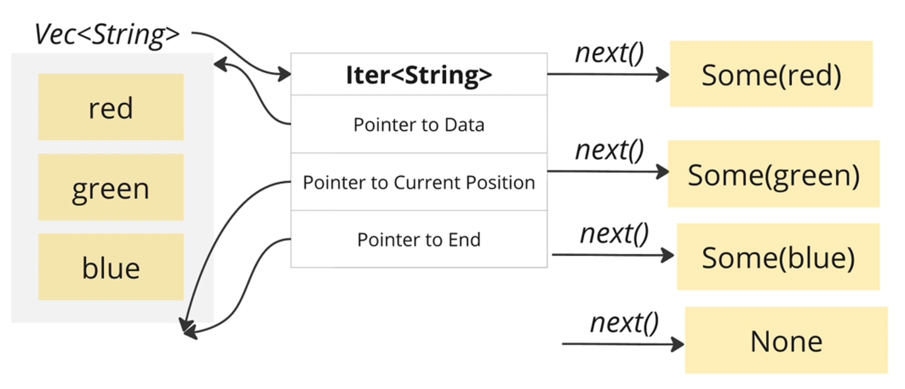

Let's try to implement several funcitons using the concept of `iter`,


#### Using For Loops with Itorators

`for` loop will,

- automatically create an iterator for the vector
- call `next` on the iterator and unwrap the `Option` that comes back
- break once the `next` returns `None`

```rust
fn print_elements(elements: &Vec<String>) {
    for element in elements {
        println!("{:#?}", element);
    }
}
```

#### Using for Iterator Adaptors and Consumers

Iterators are "lzay". Nothing happens util,

1. we call `next`
2. use a iterator consumer that calls `next` automatically

Iterator consumer is like `for_each`,

- consumer calls `next` automatically

```rust
fn print_elements(elements: &Vec<String>) {
    elements.iter().for_each(|el| println!("{}", el));
}
```

Iterator adaptor is like `map`,

- adapter creates a step in a process pipeline
- adapter doesn't call `next`

```rust
fn print_elements(elements: &Vec<String>) {
    elements
        .iter()
        .map(|el| format!("{} {}", el, el))
        .for_each(|el| println!("{}", el));
}
```

#### Introduce Vector Slices

Same idea of `&String` and `&str`, we have `&Vec<String>` and `&[String]`.

`&Vec<String>` 👉 reference to the vector of string


`&[String]` 👉 vector slices


Usually we want to use `$[String]` type more, because with `$[String]` it can be called with both full vector `&Vec<String>` and a portion of the vector `&[String]`.

```rust
fn print_elements(elements: &[String]) { /*...*/ }

// works on both input
print_elements(&elements);
print_elements(&elements[1..2]);
```

#### Different Types of Iter Functions

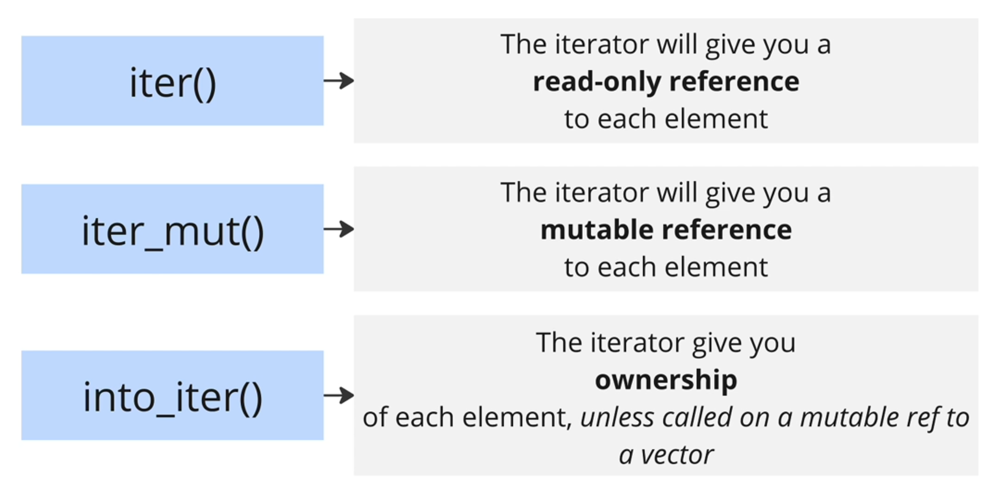

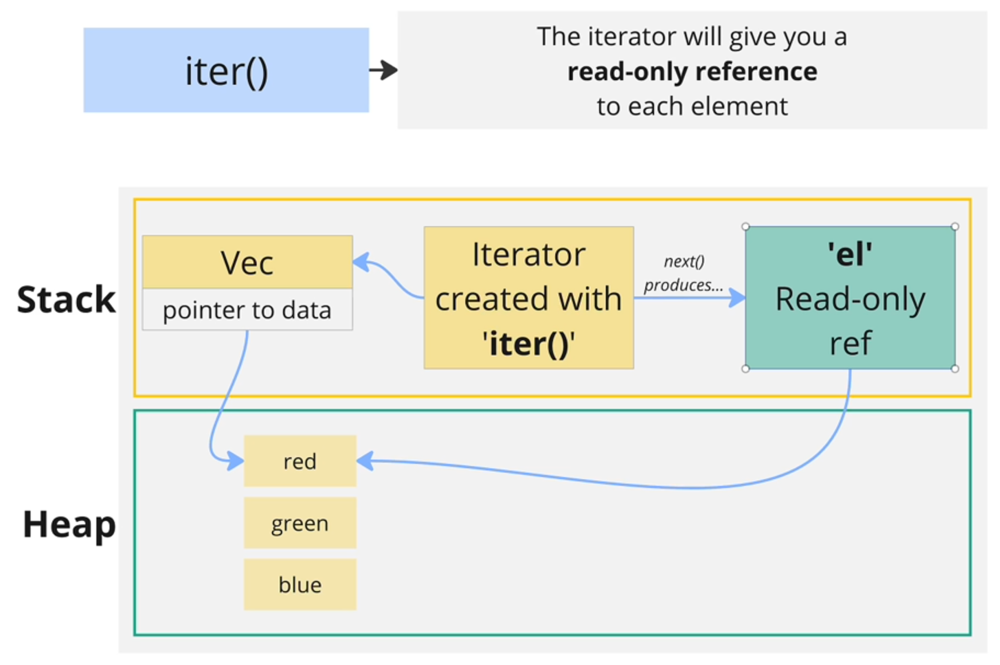
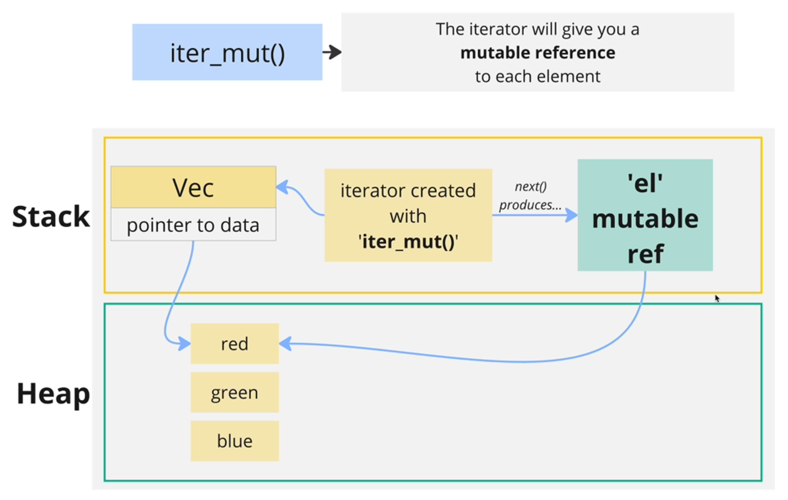

#### Introduce Mutable Vector Slices

- `&[String]`: vector slice
- `&mut [String]`: mutable vector slice

```rust
// modify the values in place -> change the data of the input
fn shorten_strings(elements: &mut [String]) {
    elements.iter_mut().for_each(|el| el.truncate(1));
}
```

Try to work on `to_uppercase` function,

```rust
// return a brand new vector of strings
fn to_uppercase(elements: &[String]) -> Vec<String> {
    elements.iter().map(|el| el.to_uppercase()).collect()
}
```

#### Introduce collect Function

`collect` is iterator consumer.

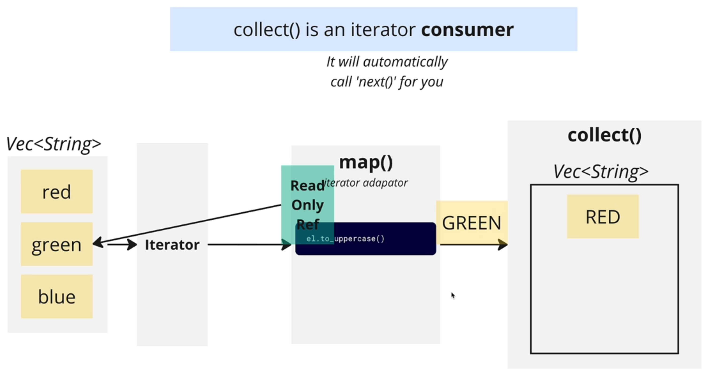

`Iterator` can be used to iterate over many kinds of data structures, like `Vec`, `HashMap`, `LinkedList`, etc. Likewise, `collect` can gather values into those kinds of data structures.

The tricky part is, how does `collect` decide what kind of data structure it's going to create?

👉 By type annotations.

```rust
// use annotation on function return type
fn to_uppercase(elements: &[String]) -> Vec<String> {
    elements.iter().map(|el| el.to_uppercase()).collect()
}

// use annotation on variable type
let data: LinkedList<String> = elements.iter().map(|el| el.to_uppercase()).collect()

// more explicitly, use turbofish
fn to_uppercase(elements: &[String]) -> Vec<String> {
    elements.iter().map(|el| el.to_uppercase()).collect::<Vec<_>>()
}
```

❗ the annotations actually affects on how the code runs.

#### Introduce into_iter Function


Let's work on `move_item` function,

```rust
// vec_a move to vec_b
fn move_elements(vec_a: Vec<String>, vec_b: &mut Vec<String>) {
    vec_a.into_iter().for_each(|el| vec_b.push(el));
}
```

Let's work on `explode` function,


```rust
fn explode(elements: &[String]) -> Vec<Vec<String>> {
    elements
        .iter()
        .map(|el| el.chars().map(|c| c.to_string()).collect())
        .collect()
}
```

Let's work on `find_color_or` function,

:speech_balloon: Discussion about what type should we returning here?

If we return `&str`, let's imagine how we will use this function,

```rust
let colors = vec!["red", "green", "blue"];
let found = find_colros_or(colors, "red", "orange");

// at some point of time,'colors' is out of scope and the values it owns will be dropped
// but we still have a ref 'found' pointing to one of the item in 'colors'
// and so will result in error!
```

So it will mostly be a good idea to return a `String` type, not a `string slice`.

```rust
fn find_color_or(colors: &[String], search: &str, fallback: &str) -> String {
    colors
        .iter()
        .find(|el| el.contains(search))
        .map_or(String::from(fallback), |el| el.to_string())
}
```

#### Introduce find Function

`find` is a iter consumer.

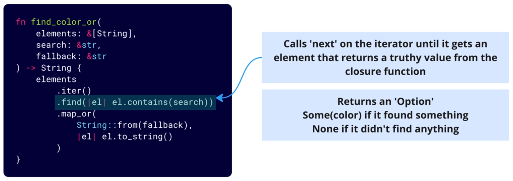

#### Introduce map_or Function

`map_or` is function that is tighed to `Option` enum, it has nothing to do with the `map` function tighed to iter function.


#### Introduce the filter Function

```rust
let accounts: Vec<Account> = vec![
    Account { balance: 0 },
    Account { balance: 10 },
    Account { balance: -15 },
    Account { balance: 27 },
    Account { balance: -3 }
];

let negative_accounts = accounts
    .iter()
    .filter(|x| x.balance < 0)
    .collect::<Vec<_>>();
```

## Advanced Lifetimes: Mastering Rust's Memory Model

Lifetime annotations: `<'a>`, `&'a`

- used with functions, structs, enums, etc
- help the compiler to make sure refs won't outlive the value they refer to
- this seems like something the compiler should do on its own

let's try to work on these functions,


```rust
fn next_language(languages: &[String], current: &str) -> &str {
    let mut found = false;
    for language in languages {
        if found {
            return language;
        }
        if language == current {
            found = true;
        }
    }
    languages.last().unwrap()
}

fn main() {
    let result;
    {
        let languages = vec![
            String::from("rust"),
            String::from("typescript"),
            String::from("python"),
        ];
        result = next_language(&languages, "rust");
    }
    // we will get an error. languages is dropped here
    // but result is the ref to the item in languages

    println!("{:#?}", result);
}
```

One big reason why do we need lifetime annotations,


And Rust will NOT analyze the body of your function to figure out whether the return ref is pointing at the first of the second argument.


Super common questions:

1. Why does it matter whether the return ref points at the first or the second argument? -> If you returned a reference without clarifying which argument's lifetime it depends on, you might risk referencing a value that goes out of scope.
2. Why doesn't Rust analyze the function body to figure out if the returned ref pointes at the first or second argument? -> The function signature makes it clear that the returned ref will be tied to which argument.

```rust
fn split<'a>(text: &'a str, pattern: &str) -> &'a str
```

Generally when a function is receiving a ref and returning a ref, we have to think about the lifetime issues. However, there are 2 scenarios we can omit the lifetime annotations,

1. Function that takes one ref and any number of values, and returns one ref.

```rust
fn first_language(languages: &[String]) -> &str
fn generate(set: &[i32], range: i32) -> &str
fn leave(message: &Message, text: String) -> &str
```

2. Method that takes `&self` and any number of other refs, and returns one ref. -> Rust will assume the returned ref will point at `&self`.

```rust
struct Bank {
    name: String,
}
impl Bank {
    fn get_name(&self, default_name: &str) -> &str {
        &self.name
    }
}
```

> Omitting lifetime annotations is referred to as **elision**.

## Generics and Traits: Writing Flexible, Reusable Code

Let's say we want to build a `solve` function that can solve the Pythagorean theorem for any float numbers, `f32` or `f64`.

```rust
use num_traits::Float;

fn solve<T: Float, U: Float>(a: T, b: U) -> f64 {
    let a_tof64 = a.to_f64().unwrap();
    let b_tof64 = b.to_f64().unwrap();

    (a_tof64.powi(2) + b_tof64.powi(2)).sqrt()

}
fn main() {
    let a: f32 = 3.0;
    let b: f64 = 4.0;
    println!("{:#?}", solve(a, b));
}
```

If we want make `solve` function to work with ANY type of numbers, we can simply replace `Float` with `ToPrimitive` trait.

### Traits

In the example above, `Float` is a trait. Traits are like interfaces in other languages.

- A trait is a set of methods that a type must implement.
- It can contain **abstract methods** which don't have an implementation.
- It can also contain **default methods** which have an implementation.

```rust
trait Vehicle {
    // abstract method
    fn start(&self);
    // default method
    fn stop(&self) {
        println!("Vehicle stopped");
    }
}
```

- A struct, enum, primitive, etc can implement a trait.
- The implementer has to provide an implementation for all the **abstract methods**
- The implementer can **optionally** override the default methods.

```rust
struct Car {};
impl Vehicle for Car {
    fn start(&self) {
        println!("Car started");
    }
}
```

Now after we implement the trait `Vehicle` for the struct `Car`,

1. `Car` is considered to be a type `Vehicle`
2. `Car` can access to the methods defined in the `Vehicle` trait

```rust
fn start_and_stop<T: Vehicle>(vehicle: &T) {
    vehicle.start();
    vehicle.stop();
}

fn main() {
    let car = Car {
        model: String::from("Toyota"),
        year: 2021,
    };
    start_and_stop(&car);
}
```

### Learn by Example

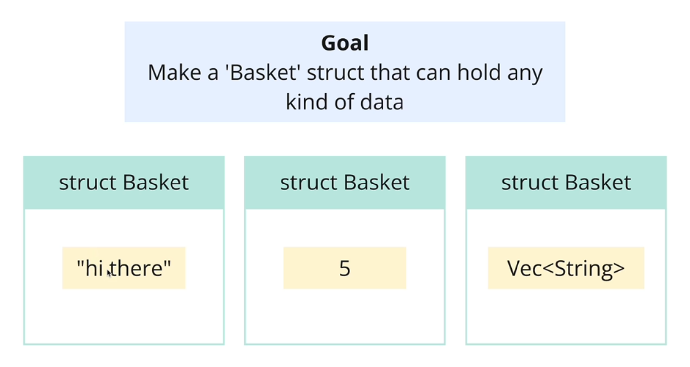


Let's start to implement the `Basket` struct, but only for `String` type.

```rust
// basket.rs
pub struct Basket {
    item: Option<String>,
}

impl Basket {
    pub fn new(item: String) -> Self {
        Basket { item: Some(item) }
    }
    pub fn get(&mut self) -> Option<String> {
        self.item.take()
    }
    pub fn put(&mut self, item: String) {
        self.item = Some(item);
    }
    pub fn is_empty(&self) -> bool {
        self.item.is_none()
    }
}

// main.rs
mod basket;

use basket::Basket;

fn main() {
    let mut basket = Basket::new(String::from("apple"));
}
```

Now we want to make `Basket` struct to work with any type of items, we can use generics.

Notice a bit confusing syntax here, `impl<T> Basket<T>`,


```rust
// basket.rs
pub struct Basket<T> {
    item: Option<T>,
}

impl<T> Basket<T> {
    pub fn new(item: T) -> Self {
        Basket { item: Some(item) }
    }
    pub fn get(&mut self) -> Option<T> {
        self.item.take()
    }
    pub fn put(&mut self, item: T) {
        self.item = Some(item);
    }
    pub fn is_empty(&self) -> bool {
        self.item.is_none()
    }
}

// main.rs
mod basket;

use basket::Basket;

fn main() {
    let mut basket_1 = Basket::new(String::from("apple"));
    let mut basket_2 = Basket::new(100);
    let mut basket_3 = Basket::new(true);
}
```

Now we can make `Basket` struct to work with any type of items,

```rust
// stack.rs
pub struct Stack<T> {
    items: Vec<T>,
}

impl<T> Stack<T> {
    pub fn new(items: Vec<T>) -> Self {
        Stack { items }
    }
    pub fn get(&mut self) -> Option<T> {
        self.items.pop()
    }
    pub fn put(&mut self, item: T) {
        self.items.push(item);
    }
    pub fn is_empty(&self) -> bool {
        self.items.is_empty()
    }
}

// main.rs
mod stack;

use stack::Stack;

fn main() {
    let mut stack_1 = Stack::new(vec![
        String::from("apple"),
        String::from("banana"),
        String::from("cherry"),
    ]);
    let mut stack_2 = Stack::new(vec![1, 2, 3]);
    let mut stack_3 = Stack::new(vec![true, false, true]);
}
```

Now let's implement the `Container` trait so that we can work with `Basket` & `Stack` by using trait bounds,

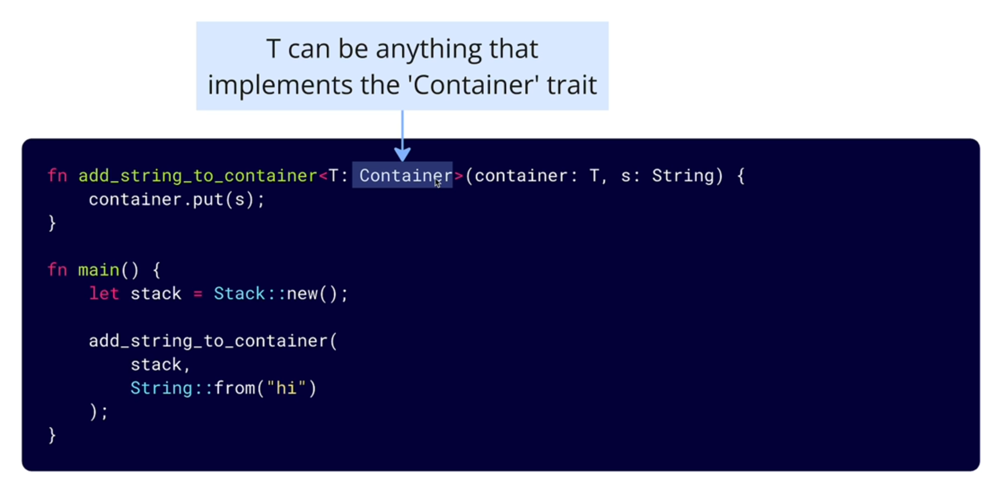

```rust
// container.rs
pub trait Container<T> {
    fn get(&mut self) -> Option<T>;
    fn put(&mut self, item: T);
    fn is_empty(&self) -> bool;
}

// basket.rs
use super::container::Container;

pub struct Basket<T> {
    item: Option<T>,
}

impl<T> Basket<T> {
    pub fn new(item: T) -> Self {
        Basket { item: Some(item) }
    }
}

impl<T> Container<T> for Basket<T> {
    fn get(&mut self) -> Option<T> {
        self.item.take()
    }
    fn put(&mut self, item: T) {
        self.item = Some(item);
    }
    fn is_empty(&self) -> bool {
        self.item.is_none()
    }
}

// same as stack.rs
// ...

// main.rs
mod basket;
mod container;
mod stack;

use basket::Basket;
use container::Container;
use stack::Stack;

fn add_string<T: Container<String>>(container: &mut T, item: String) {
    container.put(item);
}

fn main() {
    let mut basket = Basket::new(String::from("ball"));
    add_string(&mut basket, String::from("pencel"));

    let mut stack = Stack::new(vec![
        String::from("apple"),
        String::from("banana"),
        String::from("cherry"),
    ]);
    add_string(&mut stack, String::from("grape"));
}
```
