# Iterators: Deep Dive Efficient Data Processing

- used to iterate over _any_ kind of data structure
- follow all the same rules of ownership, borrowing and lifetimes
- used the `Option` enum

```rust
let colors = vec![
    String::from("red"),
    String::from("green"),
    String::from("blue"),
];
let mut color_iter = colors.iter();
println!("{:#?}", color_iter.next()); // Some("red")
println!("{:#?}", color_iter.next()); // Some("blue")
println!("{:#?}", color_iter.next()); // Some("green")
println!("{:#?}", color_iter.next()); // None
println!("{:#?}", color_iter.next()); // None
```

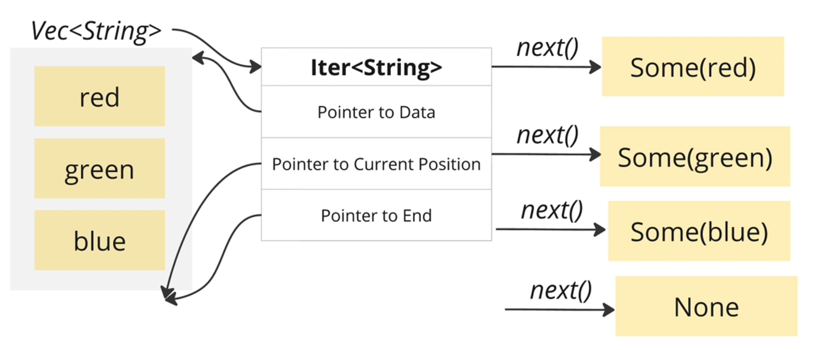

Let's try to implement several funcitons using the concept of `iter`,

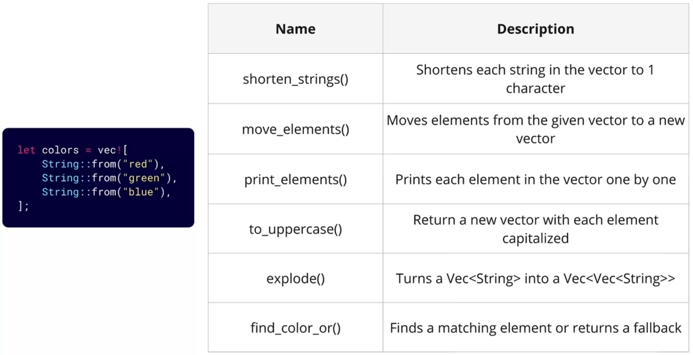

### Using For Loops with Itorators

`for` loop will,

- automatically create an iterator for the vector
- call `next` on the iterator and unwrap the `Option` that comes back
- break once the `next` returns `None`

```rust
fn print_elements(elements: &Vec<String>) {
    for element in elements {
        println!("{:#?}", element);
    }
}
```

### Using for Iterator Adaptors and Consumers

Iterators are "lzay". Nothing happens util,

1. we call `next`
2. use a iterator consumer that calls `next` automatically

Iterator consumer is like `for_each`,

- consumer calls `next` automatically

```rust
fn print_elements(elements: &Vec<String>) {
    elements.iter().for_each(|el| println!("{}", el));
}
```

Iterator adaptor is like `map`,

- adapter creates a step in a process pipeline
- adapter doesn't call `next`

```rust
fn print_elements(elements: &Vec<String>) {
    elements
        .iter()
        .map(|el| format!("{} {}", el, el))
        .for_each(|el| println!("{}", el));
}
```

### Introduce Vector Slices

Same idea of `&String` and `&str`, we have `&Vec<String>` and `&[String]`.

`&Vec<String>` 👉 reference to the vector of string

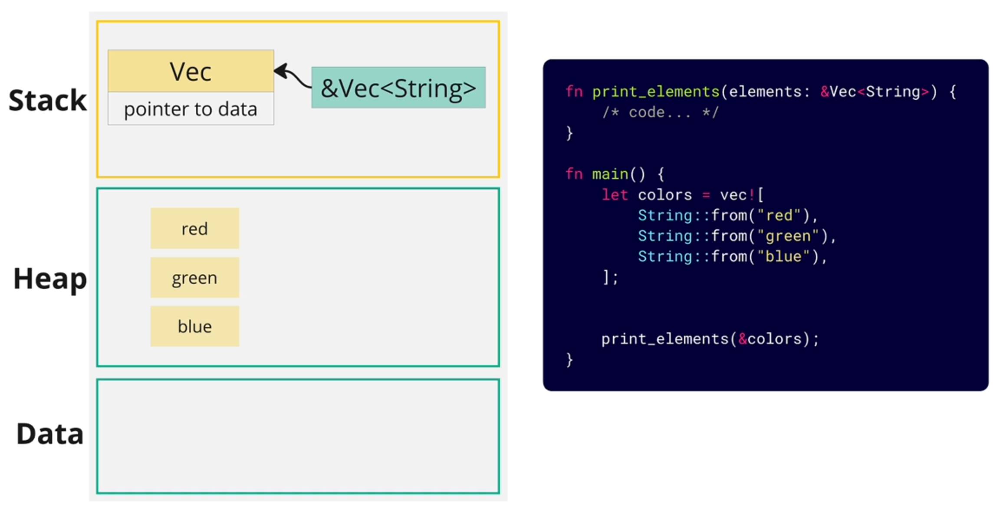

`&[String]` 👉 vector slices

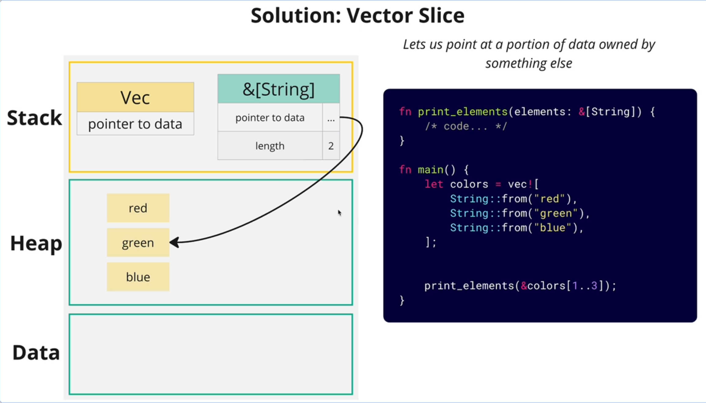

Usually we want to use `$[String]` type more, because with `$[String]` it can be called with both full vector `&Vec<String>` and a portion of the vector `&[String]`.

```rust
fn print_elements(elements: &[String]) { /*...*/ }

// works on both input
print_elements(&elements);
print_elements(&elements[1..2]);
```

### Different Types of Iter Functions

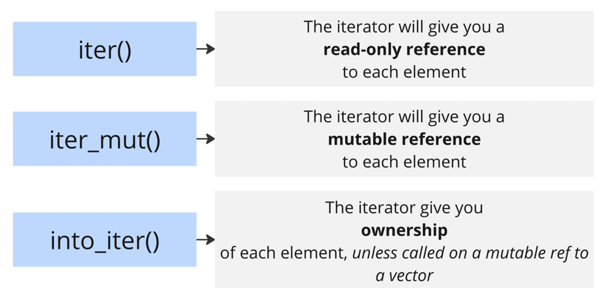

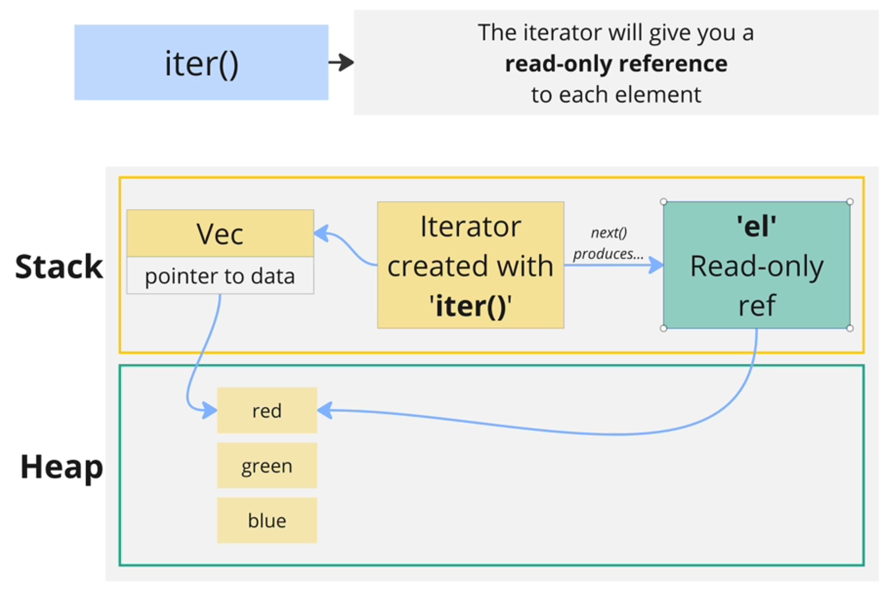
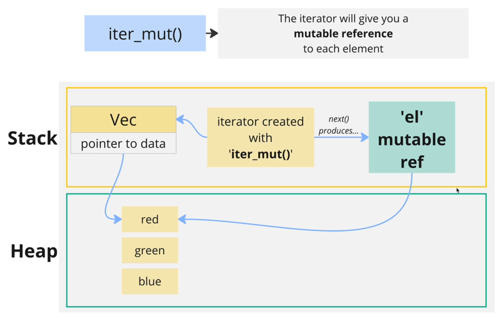

### Introduce Mutable Vector Slices

- `&[String]`: vector slice
- `&mut [String]`: mutable vector slice

```rust
// modify the values in place -> change the data of the input
fn shorten_strings(elements: &mut [String]) {
    elements.iter_mut().for_each(|el| el.truncate(1));
}
```

Try to work on `to_uppercase` function,

```rust
// return a brand new vector of strings
fn to_uppercase(elements: &[String]) -> Vec<String> {
    elements.iter().map(|el| el.to_uppercase()).collect()
}
```

### Introduce collect Function

`collect` is iterator consumer.

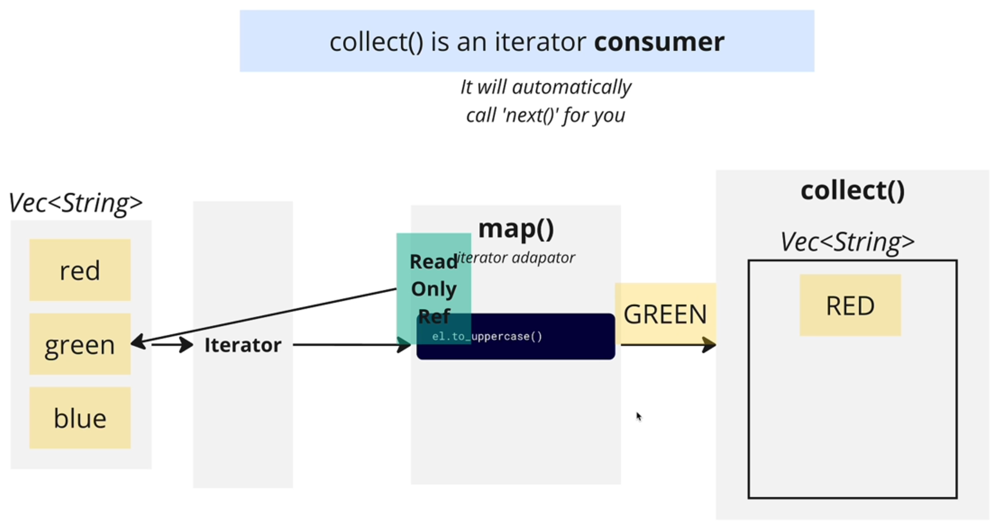

`Iterator` can be used to iterate over many kinds of data structures, like `Vec`, `HashMap`, `LinkedList`, etc. Likewise, `collect` can gather values into those kinds of data structures.

The tricky part is, how does `collect` decide what kind of data structure it's going to create?

👉 By type annotations.

```rust
// use annotation on function return type
fn to_uppercase(elements: &[String]) -> Vec<String> {
    elements.iter().map(|el| el.to_uppercase()).collect()
}

// use annotation on variable type
let data: LinkedList<String> = elements.iter().map(|el| el.to_uppercase()).collect()

// more explicitly, use turbofish
fn to_uppercase(elements: &[String]) -> Vec<String> {
    elements.iter().map(|el| el.to_uppercase()).collect::<Vec<_>>()
}
```

❗ the annotations actually affects on how the code runs.

### Introduce into_iter Function

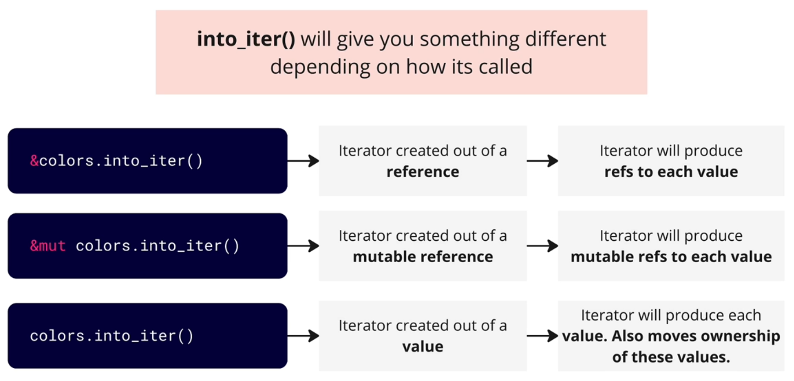

Let's work on `move_item` function,

```rust
// vec_a move to vec_b
fn move_elements(vec_a: Vec<String>, vec_b: &mut Vec<String>) {
    vec_a.into_iter().for_each(|el| vec_b.push(el));
}
```

Let's work on `explode` function,

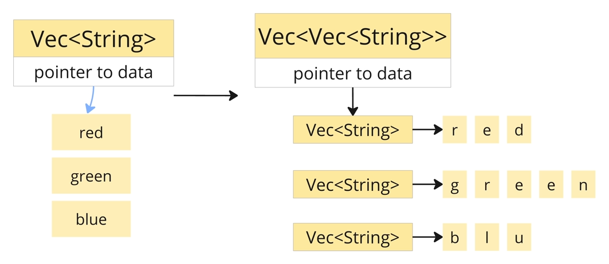

```rust
fn explode(elements: &[String]) -> Vec<Vec<String>> {
    elements
        .iter()
        .map(|el| el.chars().map(|c| c.to_string()).collect())
        .collect()
}
```

Let's work on `find_color_or` function,

:speech_balloon: Discussion about what type should we returning here?

If we return `&str`, let's imagine how we will use this function,

```rust
let colors = vec!["red", "green", "blue"];
let found = find_colros_or(colors, "red", "orange");

// at some point of time,'colors' is out of scope and the values it owns will be dropped
// but we still have a ref 'found' pointing to one of the item in 'colors'
// and so will result in error!
```

So it will mostly be a good idea to return a `String` type, not a `string slice`.

```rust
fn find_color_or(colors: &[String], search: &str, fallback: &str) -> String {
    colors
        .iter()
        .find(|el| el.contains(search))
        .map_or(String::from(fallback), |el| el.to_string())
}
```

### Introduce find Function

`find` is a iter consumer.

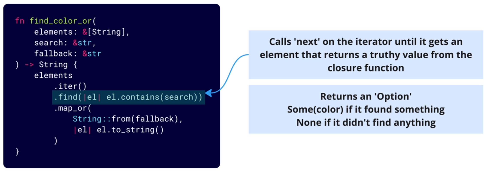

### Introduce map_or Function

`map_or` is function that is tighed to `Option` enum, it has nothing to do with the `map` function tighed to iter function.

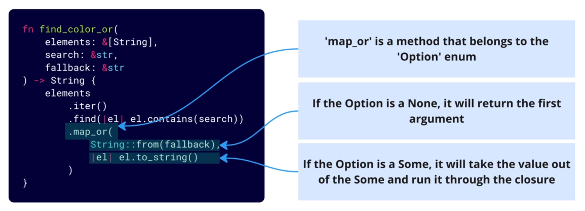

### Introduce the filter Function

```rust
let accounts: Vec<Account> = vec![
    Account { balance: 0 },
    Account { balance: 10 },
    Account { balance: -15 },
    Account { balance: 27 },
    Account { balance: -3 }
];

let negative_accounts = accounts
    .iter()
    .filter(|x| x.balance < 0)
    .collect::<Vec<_>>();
```

