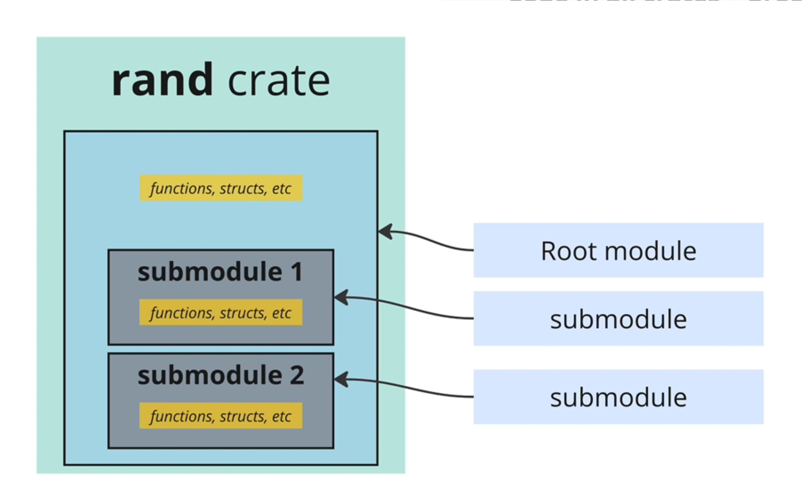
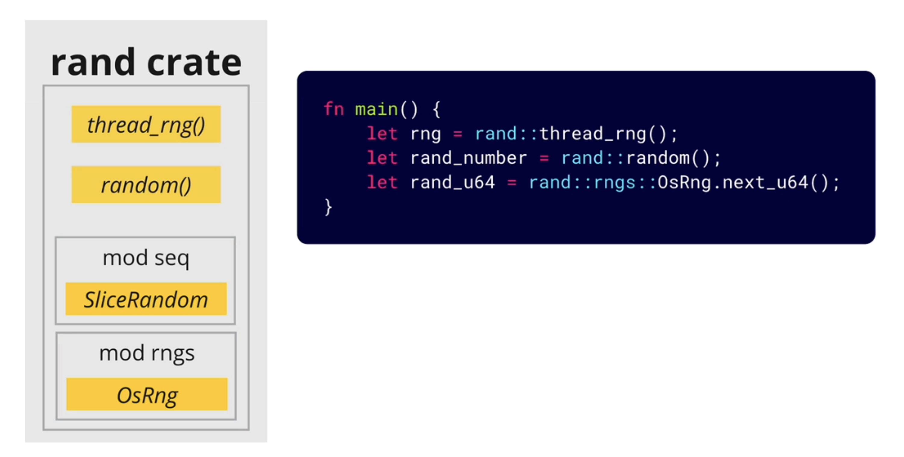

# Modules

Code in all crates are organized into _modules_.

Every crates has a **"root"** module and might have some additional submodules.



We can also create submodules in our own project to better organize our code.

## How to access modules

- We can directly access **external** modules.
- To use **internal** modules, we have to use the `mod` keyword.

```rust
// internal modules
mod games;

fn Main() {
    // external modules
    let rng = rang::thread_rng();
    let slice_random = rang::seq::SliceRandom;

    let deck = games::Deck::new();

}
```

When we have many modules to use, it's easy to start getting tedious to write out `rand::some_function` repeatedly. There is a shortcut that we can use `use` keyword to pull specific things into the scope.



```rust
use rand::thread_rng;
use rand::random;
use rand::rngs::OsRng;

// or they can be condensed into one line
use rand::{thread_rng, random, rngs::OsRng};


fn main() {
    let rang = thread_rng();
    let rand_number = random();
    let rand_u64 = OsRng.next_u64();}
```

## How to create modules

Three ways:

1. Create a module in an existing file.

> functions, structs, enums, etc. must have the `pub` keyword to make them visible outside the module

```rust
mod content {
    pub enum Media { /* */ };
    pub struct Catalog { /* fields */ };
}

fn main() {
    let catalog = content::Catalog::new();
}
```

2. Create a module in a new file in the same folder.

```rust
// src/contents.rs
pub enum Media { /* */ };
pub struct Catalog { /* fields */ };
```

```rust
// src/main.rs
mod content;

fn main() {
    let catalog = content::Catalog::new();
}
```

3. Spread code out among several separate files in a new folder.
   - every file and **folder** makes its own separate module
   - cannot do deeply nested imports -> have to chain imports
   - whenever we make a folder under _src_, we have to place a `mod.rs` under it
   - `super` refers the parent module

```rust
// src/content/media.rs
#[derive(Debug)]
pub enum Media {
    Book { title: String, author: String },
    Movie { title: String, director: String },
    AudioBook { title: String },
    Podcast(u32), // unlabeld field
    Placeholder,
}
impl Media {
    pub fn description(&self) -> String {
        if let Media::Book { title, author } = self {
            format!("Book: {} {}", title, author)
        } else if let Media::Movie { title, director } = self {
            format!("Movie: {} {}", title, director)
        } else if let Media::AudioBook { title } = self {
            format!("Audio Book: {}", title)
        } else if let Media::Podcast(id) = self {
            format!("Podcast: {}", id)
        } else if let Media::Placeholder = self {
            format!("Placeholder")
        } else {
            String::from("Media description")
        }
    }
}
```

```rust
// src/content/catalog.rs
use super::media::Media;

#[derive(Debug)]
pub struct Catalog {
    items: Vec<Media>,
}
impl Catalog {
    pub fn new() -> Self {
        Catalog { items: vec![] }
    }
    pub fn add(&mut self, media: Media) {
        self.items.push(media);
    }
}
```

```rust
// src/content/mod.rs
pub mod media;
pub mod catalog;
```

```rust
// src/main.rs
mod content;

use content::media::Media;
use content::catalog::Catalog;

fn main() {
    let book = Media::Book {
        title: String::from("A book."),
        author: String::from("An author"),
    };
    let movie = Media::Movie {
        title: String::from("A movie."),
        director: String::from("A director"),
    };
    let audio_book = Media::AudioBook {
        title: String::from("An audiobook."),
    };
    let podcast = Media::Podcast(1);
    let placeholder = Media::Placeholder;

    let mut catalog = Catalog::new();
    catalog.add(book);
    catalog.add(movie);
    catalog.add(audio_book);
    catalog.add(podcast);
    catalog.add(placeholder);

    println!("{:#?}", catalog);
}
```

