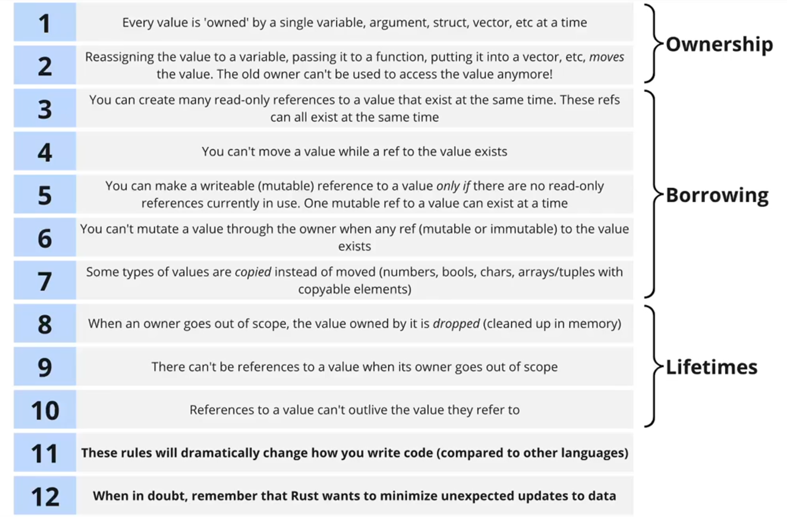
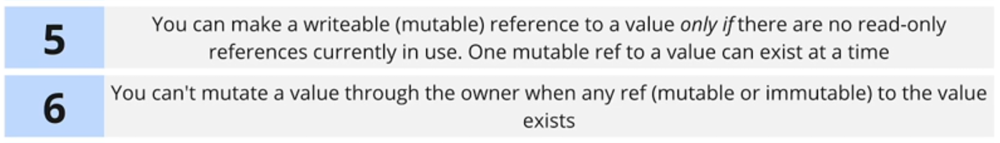
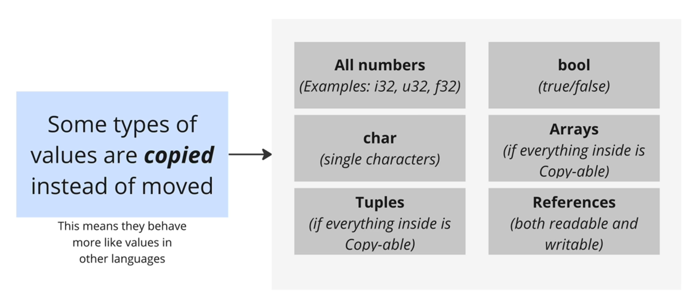

# Rust Memory System: Ownership and Borrowing

The goal of ownership is to limit the ways you can **reference** and **change** the data. This limitation will reduce the number of bugs and make your code easier to understand.

Consider a buggy code in JavaScript:

```javascript
const engine = {
  working: false,
};
const honda = {
  name: "Honda",
  engine,
};
const toyota = {
  name: "Toyota",
  engine,
};
```

This piece of code is buggy because both cars are referenced to the same value. If we change the state of honda's engine, toyota will also be affected.

We can avoid this bug by having some rules,

1. Multiple things can refer to a value at the same time, but the reference ensures the value is read-only.
2. The value can only be updated when there are no read-only reference to it.
3. The value can only be updated when it's referenced to ONLY one thing.

Here are the 12 rules to check of ownership, borrowing and lifetimes concepts,



> In essence, Rust wants to avoid **unexpected updates**.

## Introduce Ownership


For rules 1 and 2 that are related to ownership, let's consider the code below:

```rust,editable
#[derive(Debug)]
struct Account {
    id: u32,
    balance: i32,
    holder: String,
}
impl Account {
    fn new(id: u32, holder: String) -> Self {
        Account {
            id,
            holder,
            balance: 0,
        }
    }
}
fn print_account(account: Account) {
    println!("account: {:#?}", account);
}

fn main() {
    let account = Account::new(1, String::from("kevin"));

    // value moved -> pass it to a function
    print_account(account);
    print_account(account); // error: use of moved value

    // value moved -> reassign the value to another value
    let another_account = account;
    print_account(account); // error: use of moved value

    // value moved -> put it into a vector
    let accounts = vec![account];
    print_account(account); // error: use of moved value

    // value partially moved
    let holder_name = account.holder;
    print_account(account); // error: use of partially moved value
}
```

## Introduce Borrowing System

Ref allows us to look at a value without moving it.

- `&` operator being used on a type -> This argument needs to be a reference to a value.
- `&` operator being used on the owner of a value -> Create a reference to a this value.

```rust
fn print_account(account: &Account) {
    println!("account: {:#?}", account);
}

fn main() {
    let account = Account::new(1, String::from("kevin"));

    print_account(&account);
    print_account(&account);
}
```

For rules number 3 & 4, consider code below:


```rust
fn main() {
    let account = Account::new(1, String::from("kevin"));
    let ref_account_0 = &account;
    let ref_account_1 = &account;
    let ref_account_2 = &account; // we can create many immutable references to the value
    let other_account = account; // error: cannot move because it is borrowed

    print_account(ref_account_0);
    print_account(ref_account_1);
    print_account(ref_account_2);
}
```

### Introduce Mutable References

Mutable references allow us to change or read a value without moving it.

```rust
fn change_account_balance(account: &mut Account, amount: i32) {
    account.balance = amount;
}

fn main() {
    let mut account = Account::new(1, String::from("kevin"));
    change_account_balance(&mut account, 200);
}
```

For rules 5 & 6, consider code below:



```rust
fn main() {
    let mut account = Account::new(1, String::from("kevin"));
    let account_ref = &account;

    // error: cannot borrow 'account' as mutable because it's borrowed as immutable
    change_account_balance(&mut account, 200);

    println!("{:#?}", account_ref);
}
```

```rust
fn main() {
    let mut account = Account::new(1, String::from("kevin"));

    // error: one mutable reference to a value can exist at a time
    let account_ref = &mut account;
    change_account_balance(&mut account, 200);

    println!("{:#?}", account_ref);
}
```

```rust
fn main() {
    let mut account = Account::new(1, String::from("kevin"));

    let account_ref = &mut account;
    // error: cannot mutate a value through the owner when any reference to the value exists
    account.balance = 0;

    change_account_balance(&mut account, 200);
    println!("{:#?}", account_ref);
}
```

For rule #7, we need to remember there are some types of values will be copied instead of moved.




## Introduce Lifetimes

`Lifetimes` refers to how long an owner/reference exists.


For rules 8 to 10, consider the code below:

```rust
fn make_and_print_account() -> &Account {
    let account = Account::new(1, String::from("kevin"));
    println!("{:#?}", account);

    // error: owners goes out of scope while a reference still exists
    &account

    // after this point, the 'account' binding and the Account value are dropped
}

fn main() {
    let account_ref = make_and_print_account();
    println!("{:#?}", account_ref);
}
```

> With every function we write we have to think about we're receiving **values** or **refs**.

> With every data structure we write we have to think about whether we're storing **values** or **refs**.

## Deciding on Argument Types

Three cases:

1. Need to store the argument somewhere? -> Favor taking ownership.
2. Need to do a calculation with the value -> Favor receiving a read-only ref.
3. Need to change to value in some way -> Favor receiving a mutable ref.

Consider add a method `add_account` into `Bank`, add `deposit` and `withdraw` methods into `Account`,

What is the argument type should we put?

```rust
struct Account {
    id: u32,
    balance: i32,
    holder: String,
}
impl Account {
    fn new(id: u32, holder: String) -> Self {
        Account {
            id,
            holder,
            balance: 0,
        }
    }
    fn deposit(&mut self, amount: i32) -> i32 {
        self.balance += amount;

        self.balance
    }
    fn withdraw(&mut self, amount: i32) -> i32 {
        self.balance -= amount;

        self.balance
    }
}

struct Bank {
    accounts: Vec<Account>,
}
impl Bank {
    fn new() -> Self {
        Bank { accounts: vec![] }
    }
    fn add_account(&mut self, account: Account) {
        self.accounts.push(account);
    }
}

fn main() {
    let mut bank = Bank::new();
    let mut account = Account::new(1, String::from("kevin"));
    bank.add_account(account);

    account.deposit(100);
    account.withdraw(50);

    println!("{:#?}", bank);
}
```
