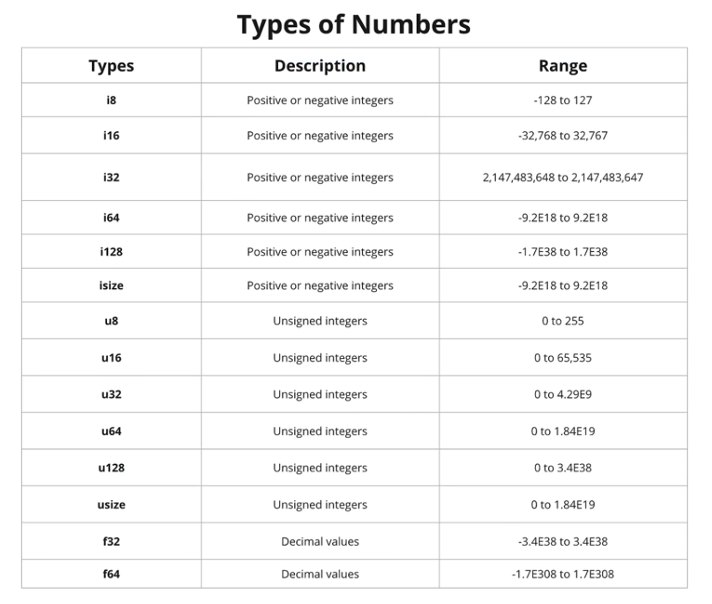

# Primitives

## Scalar Types

Types can be annotated via _suffix_ or _inferred_ by the compiler. Or for integers, can be by default(Integers default to `i32` and floats to `f64`).

Integers:

- Signed: `i8`, `i16`, `i32`, `i64`, `i128`, `isize`
- Unsigned: `u8`, `u16`, `u32`, `u64`, `u128`, `usize`
- Floating-point: `f32`, `f64`



Booleans: `bool`

Characters: `char`

Unit type: `()` - empty tuple

## Compound Types

### Arrays & Slices

An array is a collection of objects of the same type T, stored in contiguous memory. Arrays are created using brackets `[]`, and their length, which is known at compile time, is part of their type signature `[T; length]`.

Slices are similar to arrays, but their length is not known at compile time. Instead, a slice is a two-word object; the first word is a pointer to the data, the second word is the length of the slice.

Slices can be used to borrow a section of an array and have the type signature `&[T]`.

```rust
// This function borrows a slice.
fn analyze_slice(slice: &[i32]) {
    println!("First element of the slice: {}", slice[0]);
    println!("The slice has {} elements", slice.len());
}

fn main() {
    let my_array: [i32; 5] = [1, 2, 3, 4, 5];
    // All elements can be initialized to the same value.
    let five_hundred_zeros: [i32; 500] = [0; 500];

    // Arrays can be automatically borrowed as slices.
    analyze_slice(&my_array); // [1, 2, 3, 4, 5]
    // Borrow a section of the array as a slice
    analyze_slice(&my_array[1..4]); // [2, 3, 4]
}
```

### Tuples

1. tuple is a collection of values of different types
2. values can be extracted from the tuple using tuple indexing

```rust
let my_tuple = (5u32, 1u8, true, -5.04f32);
println!("tuple first value: {}", my_tuple.0);
println!("tuple second value: {}", my_tuple.1);
```
