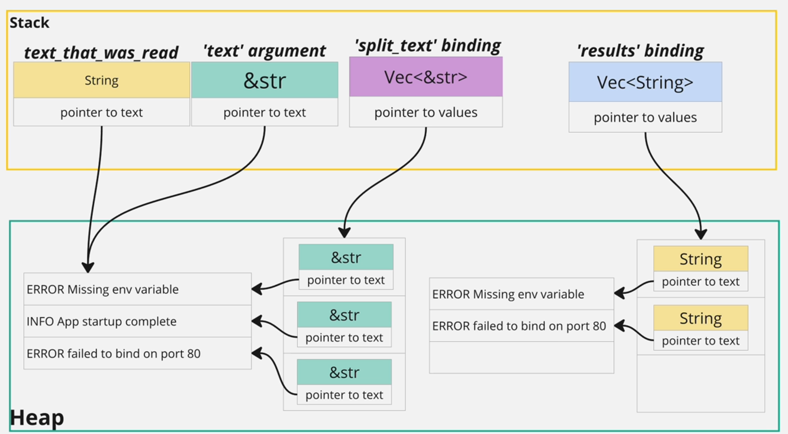

# Introduce String Types

1. `String`:

   - when we create a `String`, the `Data segment` already has the "red" literal
   - then Rust will create a struct as `String` metadata in `Stack`
   - and at the same time, Rust will copy the text data from `Data segment` and store inside `Heap`
   - the pointer of the metadata will point to the data in `Heap`

```rust
String::from("red");
"red".to_string();
```


2. `&String`: string refs (read-only)
   - after created the `String`
   - create a ref and point to the `String` struct


3. `&str`: string slices

```rust
"red";
String::from("red").as_str();
```

For `&str`, `Heap` is not used at all, there are two cases,

1st case:

- `Data segment` has the "red" literal
- Rust will create a struct as `&str` metadata in `Stack`, but it only has 2 fields
- the pointer to text field points directly to the data inside the `Data segment`


2nd case (by calling `as_str()`),

- after created the `String`
- Rust will create a struct as `&str` metadata in `Stack`, but it only has 2 fields
- the pointer to text field will point to the data inside `Heap` that is owned by other `String`


In order to discuss the difference between them, we have to understand computer memory and how it is used by Rust.

- Stack: fast but limited size(2-8 MB)
- Heap: slow but can grow to store a lot of data
- Data Segment/Rodata(Read-only data) Segment/Static Segment: store literal values that we wrote into our code

## Common Pattern in Rust


Consider this code in Rust, `let nums = vec![1, 2, 3, 4 ,5]`,

1. `Stack`: stores metadata(pointer to values, length, capacity, etc) about the data structure
2. `Heap`: stores actual data
3. `Data Segment`: the default data written in the code will be stored in data segment. when we create the vector, the list here will be copied and placed into heap.

> This is to avoid running out of memory in the stack if the data structure grows a lot of data.

Corner case: if a data structure owns another data structure, the child's metadata will be stored in the heap

```rust
// corner case
let vec_of_nums = vec![vec![1, 2, 3], vec![1, 2, 3]];
```

## Why Is There &String And &str?

Both provide a read-only reference to the text data, but there are two reasons that we prefer to use `&str`,

1. `&str` let you refer to text in the data segment without a heap allocation 👉 more efficient
2. `&str` lets you take a slice of text that is already in the heap


## When To Use Which Type?

- String
  - use anytime we want the **ownership** of text
  - use anytime we want the text that can **grow** or **shrink**
- &String
  - rarely used
  - Rust will automatically turn `&String` into `&str`
- &str
  - use anytime we **don't** want the **ownership** of text
  - use anytime when we want to take a portion of a string owned by something else


## Real Example Issue

Consider a real example of reading text from file,

```rust
use std::fs;

fn extract_errors(text: &str) -> Vec<&str> {
    let split_text = text.split('\n');

    let mut results = vec![];
    for line in split_text {
        if line.starts_with("ERROR") {
            results.push(line);
        }
    }

    results
}

fn main() {
    match fs::read_to_string("logs.txt") {
        Ok(text_that_was_read) => {
            let error_logs = extract_errors(text_that_was_read.as_str());
            println!("{:#?}", error_logs);
        }
        Err(error) => println!("why failed, {}", error),
    }
}
```

As long as we make a simple change, we start to see an error from Rust complilor 👉 'text_that_was_read' does not live long enough

```rust
fn main() {
    let mut error_logs = vec![];

    match fs::read_to_string("logs.txt") {
        Ok(text_that_was_read) => {
            error_logs = extract_errors(text_that_was_read.as_str()); // 'text_that_was_read' does not live long enough!
        }
        Err(error) => println!("why failed, {}", error),
    }

    println!("{:#?}", error_logs);
}
```

The reason is because `split` methond returns `Vec<&str>`,


Diagram of memory allocation line by line of `extract_errors` function,

> Usually for most values in Rust, it move values around, but for references, they follow **copy** synmatics.


After `extract_errors` function finished, `split_text` and `results` variables will be dropped. Then move to the `main` function, when the `Ok` statement is finished, `text_that_was_read` will be dropped while `error_logs` variable is still there since it's declaired outside of the `match` statement.

👉 And this is how the issue occurs, the `error_logs` items are trying to point to data that was dropped.


In order to fix, we just have to update `extract_errors` to return `Vec<String>` so that `results` owns the data.

When we call `to_string()`, since it returns `String`, the data is copied in the heap and owned by `results`.

```rust
fn extract_errors(text: &str) -> Vec<String> {
    let split_text = text.split('\n');

    let mut results = vec![];
    for line in split_text {
        if line.starts_with("ERROR") {
            results.push(line.to_string());
        }
    }

    results
}
```



Now, if we have a function receives a text param and returns a text, **should we always return a** `String`? It depends,

- Returning `String` requires extra allocation on the heap
- We would have been fine returning `&str` if we didn't expect it to **outlive** the input text

## Refactor Nested Match Statements

Consider the scinario after we read text from file, we want to write some modified text into new file, we'll soon see the nested `match` statement code,

```rust
fn main() {
    match fs::read_to_string("logs.txt") {
        Ok(text_that_was_read) => {
            let error_logs = extract_errors(text_that_was_read.as_str());
            match fs::write("errors.txt", error_logs.join("\n")) {
                Ok(..) => println!("Wrote errors.txt"),
                Err(error) => println!("{:#?}", error),
            }
        }
        Err(error) => println!("why failed, {}", error),
    }
}
```

There are some ways to refactor:

Option 1: use `unwrap` or `expect` 👉 use for quick debugging or example

```rust
fn main() {
    let text_that_was_read = fs::read_to_string("logs.txt").expect("failed to read file logs.txt");
    let error_logs = extract_errors(text_that_was_read.as_str());
    fs::write("errors.txt", error_logs.join("\n")).expect("failed to write file errors.txt");
}
```


Option 2: use `try` operator 👉 `?`

First of all, `main` function can return `Result` type.


We can add the `try` operator on the function that returns a `Result`.

- When function returns `Ok` 👉 automatically unwraps the `Ok` variant and assigns to the variable if any
- When function returns `Err` 👉 automatically unwraps the `Err` variant and early returns the error to the caller, in other words, it propagates the error up

```rust
fn main() -> Result<(), Error>{
    let text_that_was_read = fs::read_to_string("logs.txt")?;
    let error_logs = extract_errors(text_that_was_read.as_str());
    fs::write("errors.txt", error_logs.join("\n"))?;

    // we have to return an empty Ok variant
    // because of the return type annotation on the main function
    Ok(())
}
```

## Summary: How to Handle Function Returns Result

1. Use `match` or `if let` statement
   - if we get an error, we have a work around besides just logging it
2. Call `unwrap` or `expect` on the Result
   - quick debugging or if we want to crash on an `Err()`
3. Use the `try` operator `?` to unwrap or propagate the Result
   - when we don't want to handle the error in the **current** function 👉 we want to propagate the error up to the parent function


